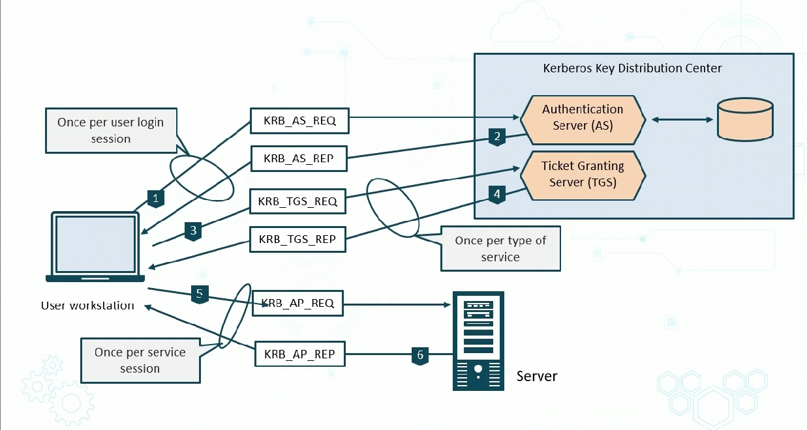

# Identity Controls

## Identity Providers
- system service that offers single set of creds for multiple platforms
    - example: logging in with FB
    - using AD when logging into CSP
- **Federated Identity** sincle profile across services
- IdP's interface with each other 

### Steps

1. Service trusts IdP

## Identity Controls

### Tokens
- AWS Security token service allows you to request temp creds for IAM or federated users

## Assertions
- Azure uses Shared Acccess Signature (URI) that grants restricted access to services

### Certificates
- Digital certificates which can be embedded in smart cards or tokens

# Account Types

1. User accounts
    - should only be for one person
2. Guest/generic accounts
    - accounts that are low hanging fruit for attackers
3. Shared accounts
    - where multiple people share one account
4. Service/Application accounts
    - bigger challenge : passwords usually dont change too often
5. Privleged and emergeny (fallback) accounts

**NOTE** Remember that malware can create seperate accounts

* A big challenge is overprivleged users
    * permission changes should be aprt of control management
* Least privlege and dual oeprator principles should be used
* There may be lack of logging/audintg/reporting
    * keep high visibility to see what is going on
* Use seperate account for admin tasks (Run as...)
    * never use programmatic access as admin
* User centralized secure systems and directory services whenevr possible
* Assess vulnerabilities from privleged insiders

# Advanced Account Policies

## Mobile Devices

- Geofencing/gelocation
    - so IT can track mobile devices
    - So they only activate based on where they're at
    - Geolocation is point on map while geofencing is an area on map
- Admins can use gelocation to find lost/stolen device while geofencing to see when device leaves area

- Mobile device management (DMD) sytems have addded features
- MDM can also be used to apply time-of-day restrictions
- GPS Tags is an app for GPS tracking

> - risk-based attirbute-bases-access-control (ABAC) for find grained authorixation
> - Example:
>   - baking API exposes approval method then ABAC is used to secure call
>   - With ABAC Sec Policy Author can write:
>       - Policy : managers can approve transactions up to approved limit
>       - Attributes used: role, action ID, object type, amount, approval limit

# Authentcation Management

## Passworld Key Management 

- Key amangement main vulnerabilities to crypto systems 
- Passwords must be used with policies strictly enforced
- AUP section on password storage and clean desk (policy that desk should be cleared) should be clear

## Password Vaults
- Passowrd managers
- Facilitate cred stoage, and SSO from devices
- Can be standalone directory or with OpenLDAP

## Trusted Computing

- Foundation fo a Trusted Execution Environments (TEE)
    - TPM - modulle embedded
        - tamper resistant sec ship
        - stores passwords, certs, and keys
        - Provides
            - integrity
                - making sure system not altered
            - Authentication
                - making sure devices are what they say
    - SED - Self encrypting drvies
        - also called Full disk encryption FDE
        - all contents are constantly encrypted
            - daat as written, decrpts data as read
        - invisiable to end user
        - Less susceptible then software absed encryption
        Provides
            - pre-boot auth. endpoint sec, device auth
            - ENcryption, key management

    - HSM (hardware security module) - dedicated crypto-processor
        - Physcial or virtual
        - Manges and processing, generating storing keys
        - verifying certs
        - Providing authentication

## Knwoledge based Authentication KBA
- Allows suers to choose sec questions and answers
- Goal is to prove identity
- Based on several info that only user can have
- Can be static or dynamic sophisticated solutions
    - dynamic can be info from credit history etc
- Can be combined with MFA and biometrics for security

# Common Authentication Protocol

## Passsword Authentication Protocol (PAP)

- PAP provides optional auth phase before going to PPP Netowrk layer protocol phase
    - upper layer communicated with Netowkr 3
- Each end of the PPP link must cent the LCP packets to set up teh data link during the MAC link establishment phase
- Auth no default
- If auth set, PAP deplyment must require the Auth-protocol config option during Link Establishment phase

## MS_CHAPv2

- Microsofts most common iteration of original Challenge authentication protocol (CHAP)
- secures PPP by encapsulating PPTP tunnel
- PPP Payload encrypted using MSCHAP, and encryption keys generated during the user authentication process
- After encryption, encapsulation takes place in PP and the frame is encapsulated with Generic Routing Encapsulation (GRE) and an IP header

> - MS-Chapv2 is very weak

## IEEE 802.1X (PNAC) Port based Network Access Control
- extension of PPP protocols, 
- Commonanly used in AAA

> - authentication is through a client which connects to a RADIUS/DIAMETER server
> - user requesting access is Supplicant
>   - supplicant is also the software
> - .1x supplicant can be windows or some cisco software
> - EAOPL Frames are sent to Netowrk Authentication Device (ACCESS POINT)
> - NAD asks for ID
>   - This ID is then checked against from RADIUS

THis process can be used with:
- Extensible Authentication protocol (EAP)
- Protected EAP
- EAP-FAST (CISCO)
    - rpelaces LEAP
- EAP-TLS
    - popular because uses xv509
- EAP  TTLS
    - tunnelng TLS

## RADIUS Remote Authentication Dial in User Service
- popular client server protocl and software that enables remote access erver (RAS) to comm with central server to auth diall-in users and authorize access to systems

## Radius Features
- uses a client-server model
- transactions use secret bw the client and server for auth
- sahred secrets never sent over network and only password encrypted
- use UDP ports 1812 (auth) and 1813 (accounting)
- earlier implentations used 1645 and 1646

# Authentcation Protocols for Federation and SSO

Five protocols

## SAML 2.0

- SML based open source SSO Standard
- ise used by many cloud SSO connections for large enterprises, govt agencies etc
- open-source interoptability is why its sued
- some companies require it

**IDentity Provider**
- SAML IDP declares ID with meta data in assertion
- LDAP or AD are common IDPs

**Service Provider**
- taked assrtion and passes to app or service
- common with social media 

## OAuath

- allows 3rd part apps to get access to HTTP service
- developers used to interact with protected data
- developers use it to store protected data and get users limited access
- need approval from resource owner
- 3rd party can used the token from owner 

## OpenID COnnect

- based id layer on top of Oatuh 2.0 protocl
- verifies the end user id using auth server
- uses REST liek methodology
- Suppoers web based and JS client
- exrensible functionality can be added liek session managemtn

## Shibboleth
- connects user to bot inter/intra organizational apps and services
- gives discrete access while also promoting user pivacy
- free, OSS and popular with uni's and public service orgs

## Kerberos
- SSO using seret key cryptosystem 
    - network wide
- uses ticket for assertion or toke
- performs mutual auth
- All comms encrpyted when id proven
- Depends on 3rd party called Key Distribution Center 
    - it is what knows eveeryon and trussts everyone in domain

# Access Control Schemes

## Discretionary Access Control (DAC)

- restrictcs access based on identity and gorup membership
- results are based on granted based on creds presented at auth
- most implements, owner can change resource access
- delivers granular access control

Advantages
- easy to implement
- alligngs with least privledge
- object owner controls acess

Disdvantages
- must eb documented
- easy for scope creep

## Role Bbased Access Control
- relies on org chart
- based on enterprise objectives and architecture
- Framework set by admins
- User does not exercise discretion
- Common in DB apps and IAM

Advantages
- easy to pmplement
- roles are assigned using writtent policy
- aligned with accepted sec principles

Disadvantages
- scope creep
- roles and access must be audited rigorsly
- Multi-tendncay caspabilities need things like AD OUs

## Rule based Access Controls
- liek firewalls
- can be dynamically assigned based on custodian or sys admin
- could be time-based ACL if NTP is used
- common for routers/switches/fws/ to use rule-based acces controls
- can be stateful 

## MAC Mandatory Access Control
- Strict non discretionary model defining rels bw subjs and objs
- assigns sensitivity labels then compares labels to user sensitivity
- common for critical info

main advantage is that  based on need to know

- based on Bell-LaPadula model for confidentiality 
    - first mathematical model with multilevel sec policy

