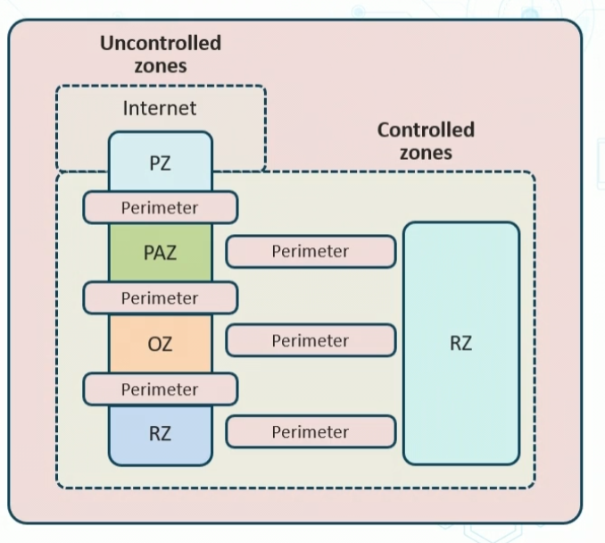
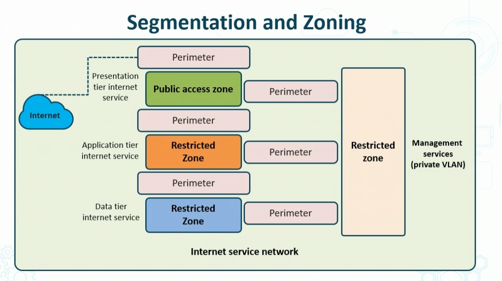
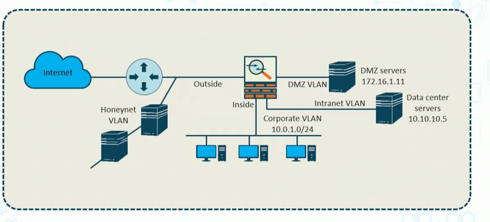
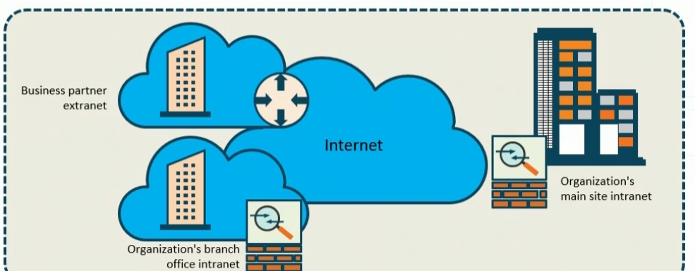
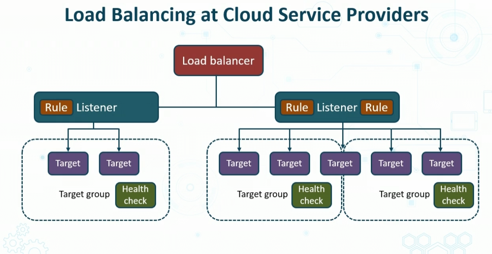
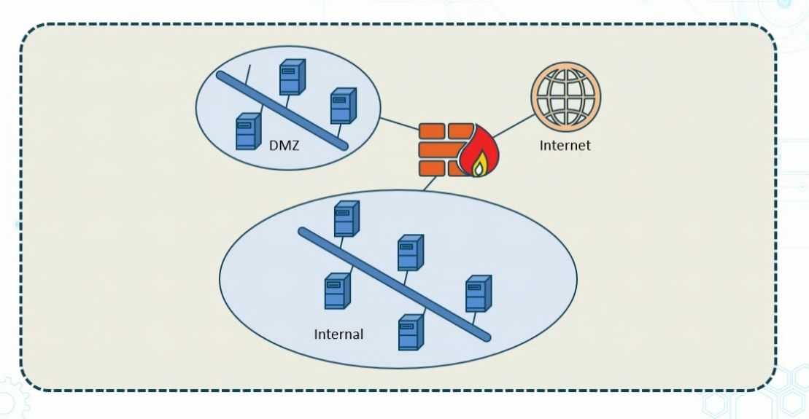

# Network Segmentation and Zoning

- Zoning is used to mitigate rick os open network by segmenting ifrastucture sevices
- it is a logical design approach used to contol and restrit access
- Each zone has funamental characteristics defined by the security

- Public access zone is the only one that is allowed to connect to the internet. 

## Zones and VLANs

## Extranets
- network with resouces onder control of another org
- Could be strategic partner or customer with a connection agreement 

## Honeypots and Honeynets

- isolated sites and services with data that apopaears valuable to attackers
- Entice malicious users to connect
    - track and log all services connected to 

# Load balancing techniques
- devices popular due to intensive apps
- optimize app avaialbility
- Distribute TCP UDP HTTP and TLS traffic across multiple servers

## Load Balancing

- Dedicated load ablancing apps are standard in physical and v-networks
- all major netwrok quipment vendors offer load balancing
- optimize app avialabiltiy, performance and offer failover solutions

## Load balancing at CSPs

- network load balancing
- reps virtualnetwork to public
    - your IP adress actually hits CSP load balancers
- performs health checks
- produces flow logs
- runs TLS listener
- can also have layer 3/4 firewalls

# Virtual Private Networks (VPNs)

- VPN gateways are dedicated termination points(concetrators) for site-to-site and remote-acces VPNs
- They can support IPsec IKE v1, v2, and SSL/TLS protocol suites
- VPNs can ber server based or application based and physical/virtual
- Routers and firewalls are common VPN gateways
    - vpns dont always involves cryp

## VPN Connection Types

1. Site-to-site or remote VPN
    -  client or clientless
1. IPsec IKEv1 or IKEv2
    - v2 is faster and more secure
    - Tunnel/Transport mode
        - tunnel is usually site to site
        - transport mode is usually from site to client
    - AH or ESP 
        - AH gives origin authenticatio and integrity
        - ESP gives confidentiality using AES 128 or 256
1. Split tunnel or Full tunnel
1. Always on VPN
1. IPv4/IPv6 either or 
1. CSP based (AWS,GCP,Azure)

# Port Security

- Switch Port Security
    - Switches function at layers 2-4
    - access switches and aggragte switches are common
    - can be physical or virtual (SDN)
    - Switch port security should be base configurationf or MAC filtering
- Switch seucurity
    - loop prevention, flood guard with BPDU and root guard configs
    - DCP snooping for Dynamic ARP inspection and IP source guard
        - can detect anamolous activity
    - VLANs and PVLANs help to enforce a layer 2 trust model on same switch, can also do compartamenaliztion
    - Protect any dynmamic trunking like VTP
    - 802.1x PNAC offers EAP-TLS, PEAP, EAP-FAST
    - MACsec offers AES-GCM-128/256 with GMAC

# Firewalls
- imntegrated systemd of threat defense, at layers 2-7
- stop fire from spreaing (not starting)
- should be placed b/w all zones, domains, and partitions (physical / logical)
    - Network or application FW
    - Restrictive v Permissive firewalls 
        - can start  permissive then become restricitver
    - stateless v stateful
        - stateful firewalls initiate from secure domain, then go to internet
        - most modern FWs are stateful
    - Clasical FWs use ACLs and inspection rules that are interface-based
    - can also be VPN and NAT Gateways

## Next Gen Firewalls
- Layer 5-7 policies
- authentication proxy (interactive or transparent)
- Identity services (ABAC)
- Integrated IDS/IPS
- Unified Threat Management (UTM)
    - can do it across services
    - Content sec and advanced malware protection with cloud services
- URL filtering
- BOTNET filtering
- Vendor cloud coordination and reputation filtering

## Web Application Firewall (WAF)
- app, server plugin, or CSP service that applies set of rules to an HTTP/S Connection
    - XSS
    - SQL injectio9n
    - CSRF
    - Buffer overflows
    - DDOS and BOTnets
    - Custom WebACL rules to match Zero day attacks
- Common WAF providers
    - Akamai 
    - fortinet
    - Cloudflare

# Network Appliances

> - Integrated network appliances have evolved from deployinfg several infastruture devices inline to providing defense in depth
> - Can combine serveral features and services by processing frames and packets in processing order
> - they often function with other specialty devices or cloud based solutions for added functionality. 

They can do:
- Network Admissions Control (NAC)
    - used IEEE 802.1x, can use ACL VLAN or more to determine teh functioanlity of requester, can send them to other site for update too
- Bastion or jump hosts
    - to connect to backend servers
- Proxy servers
- network IPS sensor
- Port mirroring or Spanning Taps
- Advances Malware Control
- VPN gateways
- Threat modeling with Machien Learning
- SIEM appliances
- NetFlow collectors

# Advanced Network Environment Solutions

## Database Activity Monitoring (DAM)
- Suite of tools used to identify and report on fradulent, illegal behavior 
- DAM system shoudl have no impact on end users
- Modern solutions provide comprehensive security services and support for unstructurrd data sec and IAM management

## Modern Endpoint Analysis

> Predict -> Prevent -> Detect -> Respond
- Endpoinnt Detection and Response
    - traditionally lightweight sensors look for malicious code and reogue apps using Behavioral analytics and threat intelligence
- User behavioraly analytics
    - ML AI
    - Honey tokens
    - both above are becoming more common'

## Hardware Security Modules (HSM)
- tamper proof hardened devices
- provide crypto processing 
- protect crypto functions
- secure keys
- seperate admin and sec domains
- apply key use policies
- can be used in place of SW crypto libraries

