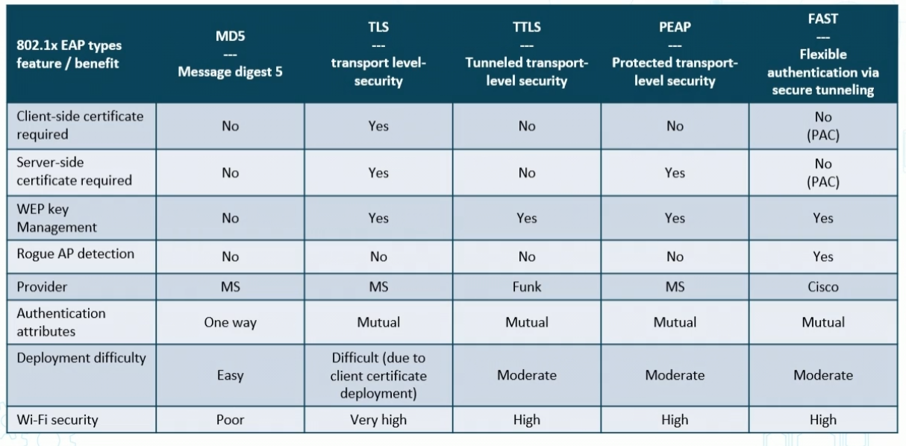

# Wireless Cryptographic and Authentication Protocols

## Wifi protected access (WPA)

- Wifi is the commercial implementation of 802.11b/g/n/ac
- A temp fix to WEP 
- uses TKIP for encrpytion and integrity
- supports PSK and enterprise authentication
- deprecated (SHOULD NOT BE USED)
- Still available on products for small office home office deployments

## WPA2
- replaces for WPA 2004
- Devices require testing and cert from Wifi alliance
- uses CCMP for encryption
- supports PSK and enterprise authentication
    - Pre share key

 ## Counter mode with cipher block chaining CCMP
 - part of 802.11i wireless std
 - designed for wimax tech
 - algo based on AES
 - uses 128 bit keys and 48 bit IV for replay attacks
 - included a MAC for data integrity and origin authentication

 ## 802.1 EAP Variants (Extensible AUthentication Protocol)
 
 - TLS is most difficult to implement
 - MD5 is easiest but very weak and deprecated
 - TLS is highest level of security

 ## WPA3
 - All WPA3 methods use latest sec methods
 - Require use of Protected Management Frames (PMF)
    - enhances privacy w/ mechanisms to improve resiliency of mission-critical networks

## WPA3 Personal
- natural password selection - lets users choose passwords that are easier to rememebr
- ease of use - enhanced protection w/ no change to how to connect
- Foward Secrecy - protect data traffic even if a password is compromised after the data was transmitted

### SAE Simultaneous Authentication of Equals
- Password based auth
- Password authed key agreement
- orginially as 802.11s
- WPA3 replaces PSK w/ SAE
- More secure initial key exchange

### WPA3
> - Authenticated encryption - GCMP-256
> - Key derivation and confrimation - 384-bit HMAC w/ Secure Hash Algorithm (HMAC-SHA384)
> - Key establishment and authentication - ECDH exchange and ECDSA using 384 bit elliptic curve
> - Robust management frame protection w/ 256-bit auth code (BIP-GMAC-256)

# Wireless Security Methods

## Wifi protected acces (WPA) Modes

### WPA PSK
- shared secret key
- manually configured on devices and AP
- local access control
- TKIP used for encryption

### WPA2-Enterpise (802.1X)
- Authentication server required
- RADIU used auth and key dist
- Centralized access control
- uses TKIP for encryption

## WPA2 modes

### WPA PSK
- ONLY difference is AES used for encrypt

### WPA2-enterprise
- ONLY changes Centralized access control with EAP variants
- Uses AES for encrypt

## WPS (wifi protected setup)
- wifi Alliance standardied method for simpplifying station set up and initial config previously called WIfi simple config
- newer wireless routers are less vulnerable
- programis not part of WPA2, and this feature should be turned off due to many known weaknesses
    -   NEVER for enterprise

## Wireless Captive Portals'
- GUI web interface in 802.1x to force EAP supplicant to upgrade, remediate or get Certs as part of CHange of AUthorization (CoA)
- Used on public wifi before access (gather temp creds)

# Wireless Installation Consideration

- Have many more considerations
- Channel selection, antenna strength, placement, interference, rogue WAP, station detection and more

Wireless LANs can be various devices, and may need to consier the bridge through a firewall

- conducting site surveys
- Presenting visualheat maps and topologies
- analyzing power outputs and interference
- Desinging channel overlays and DHCP roaming
- Stategically placing WAPs and internal/external antennas

# Mobile connection methods and recievers

## Cell tech

- multiple voice or data connections place sinto single radio channel
- involves many small inter connected transmitters instead of a large one
- major enhancemens of 4G were broadband Internet services offered to laptops, wireless modems, etc. 

## 5G
- all 5G deivcces in cell linked to internet and telephone network by radio waves through local antenna in the cell
- goal is deliver 10gbps bandwidth byu uising higher freq radio waves than cell

## Bluetooth
- Creating personal area netowrks (PANS) with many apps
- it is an IEEE radio freq standard UHF
- Bluetooth delivers confidentiality, authenticatio and key generation with custom algos based on the SAFER+ blcok cipher 

## RFID and NFC
- benefit of contactless transmit tempting
- RFID tech encodes data that is then captured by radio waves through reader
- used in inventory management counterfiet prevention etc

## NFC
- ISO IEC 14443 defines ID cards used to store info 
- ^ 18000-3 specifies RFID comms used in NFS
- also is international standard ffor all devices communcating wireless at the 13.56 MHz freq using Type A or Type B cards

## Common NFC uses cases
- attendacnce
- asset ident
- 

## Infared
- common i sfor nightvision
- used in wireless comms
- common uses are home entertainment, remote control boxes, WLANs, 

### Infared Comms
- Point to Point
    - P2P is line of sight
    - Transmitting IT data b/w devices also called beaming
- Diffuse
    - no line of sight required
    - Link b.w transmitted reciever is preserved by reflection opff surface's wireless LAN comm system

## Wireless USB
- high bandiwth wireless radio comms in PAN
- IPv6 integrated
- WiMedia ALlieance
- sometimes WUSB

## GPS
- transmit son L1 (1574 MHz ) and L2 (1227.60)
- lapps use it for abs location, relative movement and time transfer

# Mobile Device Types

- MicroSD HSM
    - lightweight HSM in MicroSD used in Android
    - Used to remotely generate backup, retore and utilize RSA and ECC crytpographic keys 
    - more popular with secure mobile wallets
- SEAndroid
    - uses Android w/ SELinux
    - Uses MAC
    - compartmentalizes the system

# Mobile Deplyment Models

## Bring Your Own Device (BYOD)
- Emplyess permitted to use their personal mobile systems
- four basic options
    - Unlimited access for personal devices
    - Access only to non sensitive systems and data
    - Access with IT control over personal devices

## Choose your own device
- lets emplyess work from anywhere with mobile deivces
- usually from approved lsit of devices

## COPE (cooperat owned and peronally enabled) 
- COmpany gives mobiel devices

## VDI For mobility devices
- utiulizes virtual desktop interface tech
- reduced cost andimproves sec and uptime
- increased agility as not just for amrtphones (COPE)
- VDI seperates app and data
- tablets use speerate keyboard mouse

# Mobile Device Management 

## Enterprise Mobility Management 
- Orgs must securely config and implement each layer of the mobile tech stack, including HW firmware, OS, management agent, provider agreemets and apps used for business
- solns reduce risk and provide access from any location using wide array of deices
- EMM is MDM + MDM

## MDM v MAM
- MDM  
    - enrolling device amanagemtn
    - provisions setting
    - monitoring and compliance
    - removing data 
- MAM
    - Publishing mobile apps to users
    - config and updating apps
    - reporting app inventory and usage
    - securing and removing corporate data within mobile apps

- Common MDM activities
    - finding lost devices
    - implemetning auth 
    - configuring pins
    - deploying and managing full device encryption
    - onboarding/offboarding/installing certs

## Mobile COntent Managmenet
- also called MIM
- falls under EMM
- can be seperate from MDM MAM and Mobile Security Management (MSM) in large enterprise
- can allow secure access to mission critical data
- Users can collab w. others on any network or device w/o work-critical data access restriction

> - colutions strike balance b.w security and productivity
>- should maintin sec
>- differs from inititives that focus on data, and instead onto the devices or application that utilize that data

## Geofencin and Geolocation
- allow IT to track
- Geolocation is point on map
- Geofencing is area on map
- geolocation is tagging
- Geofencing is to ensure it is approved to be where it is

## Mobile Biometrics
- Finger print most popular
- Voice recognition and IRIS scanning emerging

## Advanced MDM
- COnatinerizartion
    - for orchestrating apps and work data in seperate segmented user space within device
- Storage segmentation
    - partitioning various types of data to support DLP 
- FDE (Full Device Enryption)
    - strong encrpytion on hardware level 

## Mobile Sandboxing 

- provide protection, isolation, integrity functionality for better levels of data isolation
- Containerization usually MAM technique
- Users can chat w.o affecting since sensitive apps are spererated

## Sevure Enclave Processor (SEP)
- Security circuit deisgned to eprform secure services for rest of SoC
    - its own OS SEPOS w/ kernel drrivers , services apps
    - prevents main processor from gianing access to sensitive data
    - contains it own sets of peripheals
    - uses inline AES to encrypt external RAM

# Mobile Enforcement and Monitoring

## Sideloading and 3rd party apps
- sideloading unoffical apps
- in COPE and CYOD it is highly enforced
- Managers often remove unkown sources field in the device setting to block downlaoding 3rd part apps 

## Jailbreaking
- allow 3rd part apps
- can tweak what root can do
- can be exploted with malware

## Rooting
- grants full access to device on higher level than jailbreaking
- every line of code becomes editable
- on Android, much more explotable

## Mobile Enforcment and Monitoring
- Cusotmize controls
- Conduct OS and FW OTA
- Prevent custom Firmware
- Preform carrier unlocking
- Disabling microphone and camera recording

## Managing Mobile COmms Services
- data exchanges overlooked
    - SMS MMS Rich Comms Services (RCS)

## USB on the go (USB OTG)
- Mobiel devices connect to each other
- Enabling USB to be host -- additional unauthorized usb devices can be used by extension 
- USB OTG defined two roles: 
    - OTG A : device power supplier
    - OTG B : Device power consumer

## Tethering
- Making your device available to others as wireless access point 
    - reg patches and updates needed to prevent bridging and tethering from others.
- May need to enforce AUP restrictions with MDM:
    - wifi direct/ad-hoc networks
    - Hotspots
    Unauthorized domain bridged

## Mobile Devices for Payments
- Toeknization for payments and MFA
- NFC
- Mobile wallets for crypto 
- NFC for payment
- Vendor specific payments (Apple Wallat)

# Embedded System Security and Constraints

- Complete embedded source code often not available
- somtimes jus tbinary
- even when patch is available, rarely applied consistently
- Hundreds of milions on internet unpatched in last ten years

## Raspberry Pi
- single board PCs
- used to teach compsci
- now popular
- peripheals or cases not included
### Securing
- keep system updated
- cdont auto login
- change default password
- diable pi user
- stop unrequired svcs
- Make sudo require password
- SSH prevent root login
- SSH change default port (which is 22)
- use SSH keys instead of passwords
- Install Fail2Ban
    - tool to detect and block brute force

## Arduino Security
- open source protoytypgin 
- ioT and PI solutions work here

## Field Programmable Gate Arrays (FPGA)
- Fiel programmable integrated
- fuse based, and batter-backed root
- Encrypted design bitstream
- Data Erasure protection
- Glitch resistant features

## Embedded Technology Constraints

- Security Constraints with these forms of integrated chipset-based technologies are:
    - power
    - compute
    - network
    - crypto 
    - insabiltiy to patch
    - authentication 
    - implied trust
    - range
    - cost

## Securing Embedded Devices
- test in cloud before dpeloyed
- change and config management
- Patch management
- Digitally signed code
- Trusted OS and firmware
- Hire skilled systems/sec practitioners

# SCADA  - Supervisory Control and Data Acquisition

- Reps SW used to collect and send data to other facility systems
- Programmable Logic CONtrollers (PLC) are the hardware component
- Systems that are not air-gapped introduce various threats

## SCADA Examples
- Facility manufacturing control
- water management
- Electric grid
- solar wind farms
- traffic signals

## SCADA Security Concerns
- Cyber terrorism, espionage
- Lack of security in design ops and deplyment
- Lack of authentication bw devices
- lack o fstrong user auth
- lack of sec in propietary protocol services and apps
- lack of visibility and sec when internet is connected

# Internet of Things
- presents challenge for embedded computing vulnerability discovery 
- Systems powered by specialize chipos

- examples are Sensors, Facility automation, medical systems, vehicles, smart meters

## OWASP IoT Top Ten
1. Weak guessable hardcoded passwords
1. Insecure network services
1. Insecure ecosystem interfaces
1. Lack of secure update mechnism
1. Use of insecure or outdated components
1. Insufficient privacy protection
1. Insecure data transfer and storage
1. Lack of device management 
1. Insecure default settingsd
1. Lack of physical hardening

# Securing Specialized Systems

## Securing Voice over IP
> - harden and patch IP PBX
> - Make sure there is security of data in transit and high avialability RADUIUS and backend DBs
> - on VoIP firewalls:
>   - Allow only call control info (SUCH AS SIP)
>   - Allow lookup to the LDAPS server
>   - Allow management protocols in borth signaling and media access
>   - Control source addresses (SIP uses 5060/5061, H.323 uses TCP 1720) to set up call connection

## HVAC
- Provide air conditioning
- COntrolled via network
    - Open and closed
- Breached, hackers can shut down
- Hackers can get more info when breached

## Systems on a Chip (SOC)
- Combining electrical circuits of various componenets and software onto single chip
- Common IOT devices, mobile products, wearables and RFID systems
- Sec Concerns
    - Lack of security controls
    - Lack of and speed of updated
    - Privacy 
    - Malware
    - Root access

## Real time Operating System RTOS
- OS that serves real time
- in tenths of seconds
- Sec conerns:
    - Code injeciton
    - Privacy 
    - Exploiting shared mem
    - Priorities
    - DoS attacks
    - Inter-process comms

## Video Surveillance and Webcams
- Can be vulnerable
- Lack of sec policy
- Weak passwords
- poorly coded SW
- Malware
- Privacy
- Mobile and remote access
- can be used in spying

## Other Specialty Systems
- Adapative Voltafe Scaling (AVS) - dynamic power minimization adjusting voltage on PC chip to match needs
- UAV - drones can be hacked, or can be sued for spying
- Multifunction printers (MFP) - can be vulenrable

