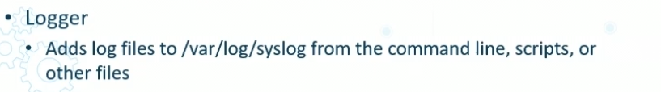
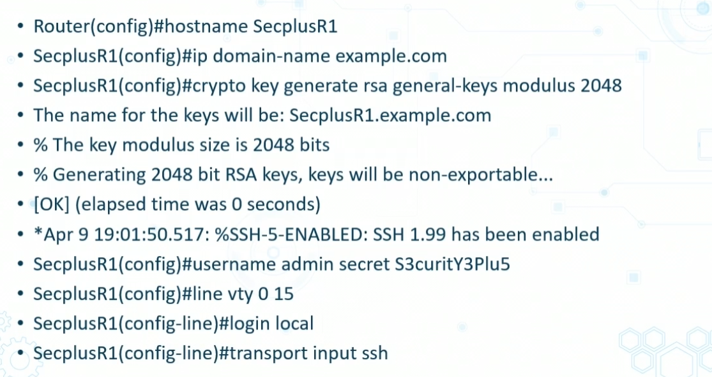
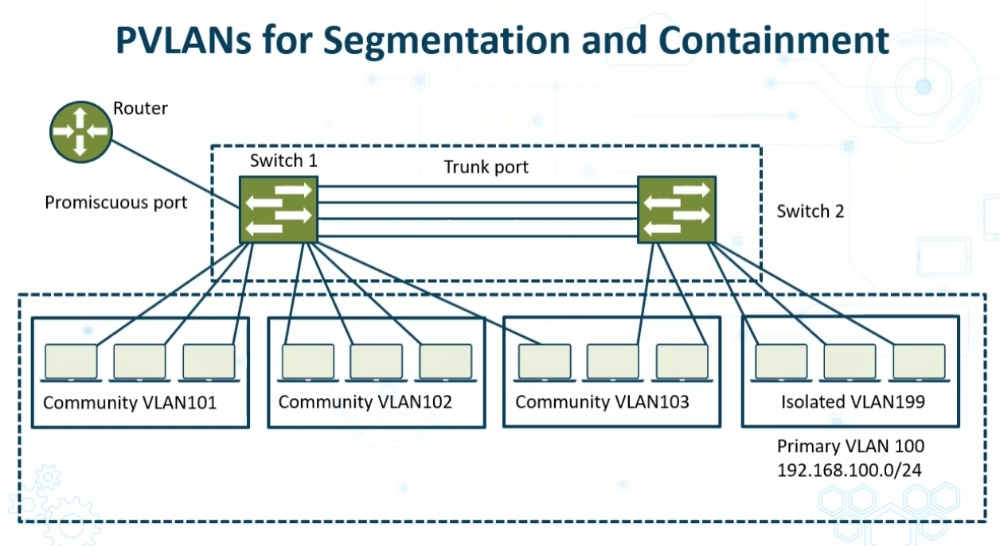

# Network Reconnaissance and Discovery 

# Ping
- works at Layer 3/4
- sends echo request to ip resolved in DNS
- defaults to 4 ping requests
- used to find discoverability 
    - also round trip time
    - can also see congestibilty

## tracert/pathping
- uses echo request/reply
- increments time to complete from 1ms and up to get ip trace 
- so you can see where you have packet loss 

## nslookup
- gives DNS answers to *server* and *address* 
- also gies non DNS answers

## DNSenum
- dns enum tool locates all DNS servers and entries
- gives:
    - computernames, and mroe

## ipconfig / ifconfig (linux)
- gives internet adapters addresses, subent, default gateways
- ipconfig/all gives everything

## netstat

- netstat -a
    - gives all UDP/TCP port connections 
    - gives Socket, ip address, and port numbers
    - good to see what ports are open on system

## arp -a
- looks in memory where ip addresses are located locally (in memory)

## route

- route print
    - in windows, shows route table

## hping

- Commindline TCP/IP pakcet assembler and netwrok analysis tool supports UDP ICMp and RAW-IP

## netcat
- swiss army knife of netwroking tools
- simplie read writes data acors TDP/UDP
- can create eany kind of connection including port binding to accept incoming connections
- Design to be a reliable back-end tool to use directly
- Often driven by other programs and scripts

## Curl

- used in command line ot facilitate data transfer
- used for plenty SW apps
- also used on vehicles and stuff

## theHarvester
- OSINT tool liek Maltego that collects emails, subdomains, hosts, employee names, open ports, and banners from various public cources like search engine, PGP key servers and the SHODAN computer DB
- intended to ehlp pentesters in early black/gray bost test to realize customer footprint on the internet

## Cuckoo Sandbox
- Open source automated malwayre analysis system tha thelps you understand the context, motivations and goals of an attack or breach
- delivers detailed report that summarizes the activities of inputted files when executed
- runs inside a realistic but isolated environment known as a sandbox
- freeware that automated the task of analyzing malicious file in Windows maOS linux and android

## Nmap
- open source tool for discovery and security auditing
- used for network inventory and managing service schedules 
- included advanced GUI and result viewer (Zenmap), flexible data transfer, redirection, and debugging tool (Ncat), a utility for comparing scan results (Ndiff) and a packet genreation and response analysis tool (NPing)

## Nessus
- most popular and capabale vulenrabiltiy scanner for NIX systems
- recently changed free version from Home to Essentials and will scan up to 16 devices for free

## sn1per 
- vuln and penetration scanning utility that collects data
- has lots of open-source tools and utilities to leverage during pen test to enumerate and scan for vulnerabilities

# Packet capture and replay toosl

# TCPreplay
- toold for modifyin gan dreiterating already-captured traffic on a network
- initially created to replay malicious traffic datagrams to IDS and IPS sensor devices and modules
- also replays to web services

## TCPDump
- output and explanation of contents of IP packets on network interfacte that match REGEX
- preceded by timestamp
- `-w` flag savespacket data to file for later analysis
- `-r` flag causes it to read from a  saved packet file than read from network interface

## Wireshark
- og name is etheral- snigger for netowrk troubleshooting analysis, SW and coms development

# File manipulation tools

## Linux File Manipulation Commands

- head 
    - outputs first N lines of file
- tail
    - last ten lines
- Cat
    - concatenates files then displays to std output (usually shell)
- Grep
    - searches REGEX in text of files
- Chmod
    - changes access perms
- Logger
    

# Shell and Scripting Environments

## Secure Shell
- SSH perfered over TelNet
- SSH 2 > SSH1
- SSH2 uses symmetric ecnryption for bulk data encryption and assymetric algos in key management processes
- SSH2 uses DH in key exchange

## SSH2 on a Cisco router

## Powershell
- command line in Microsoft
- automates tasks in Azure
- uses CMDlets and variable and functioon

## OpenSSL
- strong SSL and primary TLS protocols
- also general-purpose crypto library
- Apache style luicense so free to use for commercial and non commercial w/ some basic conditions
- heartbleed bug patched in most modern tools

# Forensic Tools

## dd 
- write disk image files to mem card and USB
- Create bootable USB
- Back up and store IMG files
- Back up and compress disk image files 
- install and restore compress image files on the fly
- supported files : IMG, ISO , ZIP, GZIPm, and XZ

## memdup
- exrtract files like jpg gif and pdf from memory dumps
- supports any binary file like .dmp .bin and .lime
- performs fiel signature based searching inside memmp and extracts them
- selects predefined profiles for specific file types and creates custom profile for a different file format

## FTK imager
- data preview and imaging tool
- assess electronic images
- creates forensic images on PC
- uses write blcoking methods
- Helps justify deeper analysis 
    - hashed volumes for chain of custody of evidence

## WInHEx
- universal hex eidtor
- usefule for forensics, data recovery, IT sec
- advanced tool for inspecting all types of files

## Autopsy
- forensic hard drive inveistigation framework
- used by law enforcement
- can be primary forensic tool

# Exploitation Kits and Password Crackers
- kits used by hackers to find vulns and attack vectors
- often specialize in certain componenets
- often open soruce initiatives for white grey and balck hats 
- can be used to prioritize4 vulns an dthreats in enterprise
    - RIG EK and RIG-v
    - GrandSoft SK
    - GreenFlash Slowdown
    - RansomWare EKs

### Password Crackers
- run repeated attempts to identify a user password and both
- also runs against stored hashed offline
- Many techniques

### Rainbow Table Attacks
- hash funciton in crypt for storing improtant data such as passwords in backen DB 
- sensitive data often hashed multiple times with same or different keys to avoid rainbow table attacks

### John the RIpper 
- free open soruce
- distributed in source code form
- John the Ripper Pro is primaryly in the form of native packages for various target OS's
- Kali has command line version called "John" an dGUI version "John the RIpper"

# Endpoint Security Solution Reconfiguration Methods

- Application Whitelisting
- Application Blacklisting
- Quarantine and remediation

# Configuration Changes for Mitigation
- Firewall rules and WAF WebACLs
- Mobile Device Management (MDM)
    - constant updates make it a challenge
- URL and COntent Filtering
    - always updating 
- Data Loss Prevention (DLP)
    - always updating databse of what shouldnt be leaked
- Revoking and updating certs
Many componenents which apply for configuration changes

# Isolation COntainment and Segmentation
- The most critical control needed to contain an intrusion and curb the spread of malware is network segmentation and software cotainment tools
    - network should be in subnets
- Flat netowrk topolgies with end to end managemetn VLANS are particularly vulnerable

- enforcing security of comms at Layer 2
    - malware breach can be prevented from spreading to other segmented VLANs

# Secure Orchestration AUtomation and Response (SOAR)
- Contasting tech that empowers ability to collect data alerts from variou s sources
- Organizations can perform threat analysis and remediation by using both systems and personnel
- helps to describe, prioritize, and support incident response activities based on standard workflows 
- tools define response processes and threat analysis in a digital workflow format so that select machine-driven activities can be automated

## SOAR Services
- Security orchestrationa nd automation
- threat intelligence
- incident response

## SOAR Playbooks
- linear checklists of neccessary procedurs to effectively react to incidents
- offer basic step by step top down IR tasks for orchestration
- Assist in developing IR processes durign investigations to make sure that the needed steps are systematically followed
- Support human and automated tasks but focus more on human intervention: liek breach notification and malware reverse enegineering