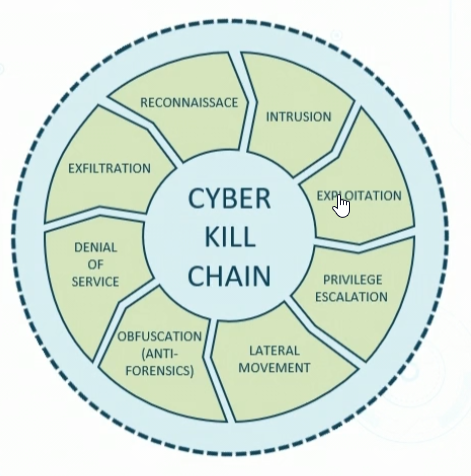
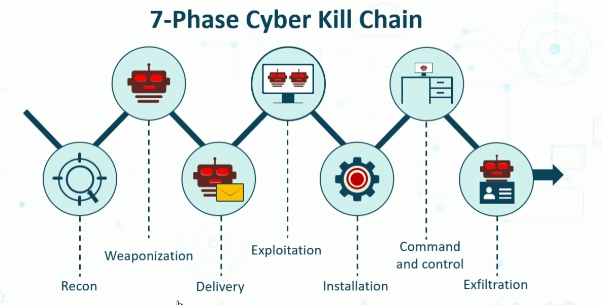

# Incident Response Plans and Processes

## Incident Response
- Steps takend when negative event happens
- Severity of incident will determine level of action
    - is it event or incident?
    - How critical?
    - What is immediate impact?
## Goals
- reduce immediate impact
- maintain and restore ops
- provide after action and lesons learned
- deter future attacks

## Processes
- Be prepared w/ plan
    - documented incident types/category definitions
    - know roles and responssibilties of first responders
    - Reporting reqs
        - contact lists
- Cyber Incidet Response Teams
    - CSIRT
    - May be out-sourced or swarm team
- Best rpactice is to have pre-preformed practice

### Lifecycle
1. Preparation
1. Identification
1. Containment
1. Eradication
1. Recover
1. Lessons Learned

### Preperation
- info gathering, 
    - get buy in from mgmt 
- ddetermine roles and responsibilities of internal employees on incident response teams
- Establish first responders and processes for comms with stakeholder
    - conduct IR drills based on budget
    - check if everyone is aware of their role

### Identification
- seprate event from incident using predefined metrics and experience
- implementation for categorizing and prioritizing incident
    - when did it occur?
    - How were you alerted?
    - Who made the discovery?
    - What is the scope of impact?
    - Does it qualify for escalation or disaster recovery?
    - Can you quickly identify the root cause?

### Containment
- Implemetn short-term processes, such as disconnecting devices from network
- Use firewalls, ML algos, and other tools to maintain containment and segregation
- Evaluate backups and snapshots for  future recovery
    - if you have zero day patch, apply it immeidately

### Eradication
- sometiems integrated with containment
- Involves determining root cause and applying remedies
- remove all IoC and artifacts associate with attack

### Recovery
- restoring negatively affected data, apps, systems 
- often involved only remediation
- vital to establish you're not vulenrable to another attack

### Lessons Leardned
- knwoledge gained from process
- sessions held at cose out
- share and use knowledge derived from experience
- endorce recurrence of positive outcomes
- preventing recurrence o fnegative outcomes

# Incident Response Excercises
- plan review
    - group discussion, plan auditing, brainstorming
- tabletop 
    - examine documented plans, diagrams, logical walkthroughs to eliminate gaps/errors
- Walkthrough (exercise)
    - planned rehearsal
    - in stages by department/building
    - should find additional gaps
-  Simulation
    - focuses on specific scennarios
    - uses BCP (business continuity planning) and DRP (disaster recovery planning) resources and teams (swarm sims)
    - Tests snapshot recovery and hot spares
    - may be highest level test
- Parallel
    - real world drill while running businness
    - more resource intensive
- Full-interruption
    - real world drill
    - cost prohibitive
        - might not be feasible to stop working / business ops 

# Attack Frameworks

## Cyber Kill Chain
- steps of attack
- Technique used to understand malware attacks
- from Lockheed Martin

### 7 Phase Cyber Kill Chain
- applies more often to botnets, DDoS or RCE

### 8 Phase Cyber Kill Chain

1. Reconnaisance
2. Intrusion
3. Exploitation
4. Privledge Escalation
5. Lateral Movement
6. Obfuscation/anti-forensics
7. Denial of service
8. Exfiltration

## MITRE ATTACK 
- KNowledge base form MITRE
- used for generating  threat modelling and threat assessment tools in all sectors
- Orgs commonly use the enterprise matrix as starting point
 ### Mitre Attack Matrix for Enterprise
> - init access
> - Execution
> - presistence
>   - leveraging extensions
> - Privlege escaltion
> - Defense evasion
>   - ofuscatin
> - Credential Access
> - Discovery
> - Lateral Movement
>   - internal spear fishing
> - Collection
> - Command and Control
> - Exfiltration
>   - destroying/manipulating data

## Diamond Model of  Intrusiton Analysis
- Emphasizes granular atacker activities and generates model tha thelps CS analysts classify relationship bw motivations, victims, and the tech used for attack

Four Elements
1. Adversary
    - persona of the person
1. Infasstructure
    - domain name etc
1. Capability
    -  tools they use
1. Victim
    - the target of the attack, person system etc

# Plan Types for the Incident Response Team (IRT)

## Business Continuity Planning (BCP/COOP)
Elements:
- Business Impact Analysis
- Disaster Recover Plan
- Backup / Restore

Dedicated IRTs may also be a part of it
- also SWARM teams

## BCP COOP
- ensure Business ops come back 
    - docs approved by executive mgmt
- outlines risk to enterprise
    -   populated risk ledger
    - reqs to mittigate incidents
- Identifies procedure for Disaster Recovery

### NIST SP 800-34 Rev 1
1. Develop COOP statement
1. Conduct BIA
1. Identify preventitive Controls
1. Create contigency strats
1. Develop info system contigency plan
1. Ensure plan training testing and exercises
1. After action report
1. Plan maintence and improvement

## DRP
- ensuring company can recover
- Tasks and processes conducted when disaster happend
- Incident may be single drive, entire server, VLAN, facility, floor, building, site or campus
- major component of BCP
- Outlines restoration
    - order
    - backups snapshots and restores
    - Contact info
        - for vendors and partners as well
    - Communication plans
    - Chain of authority
        - who steps up when missing leaders
    - Step by step instuctions
    - Locations of documents, sofware keys

## IRT
- also called CSIRT
- Recieves alers and alarms of sec breaches
- First Responders determine severity and priority
- Implements rehearsed plans and procedures
- Coducts analysis of activities and documents action plan
- may perform forensic or investigative techniques
- may be pre-design group or an ad hoc association
- May be internal or external
- internal IRTs gather preiocdically for proactive tasks, such as DR testing, and vulnerability and penetration testing and assessment
- Memebrs should come from variou sbusiness units an dhave different skillsets

# Forensic Documentation and Evidence

- Cyber forensice investiationg
- Involves scientific investigation o fcyber incident
    - data breach
    - insider attack
    - Malware campain
        - ransomware
    - DDoS 
    - Blackstoration
    - CP files
    - Pirated content
    - Any illegal activity

## Cyber FOrensics
- Carried out in standardized manner
    - Identification of crime
    - collection of evidence
    - Examination of evidence
    - Analysis of Evidence
    - Reporting on finding of analysis

## Collection of Evidence
- Capture System images
    - use write-blockers
        - should be no trace of your forensic activities on the systems 
    - forensic kits
- Network traffic and logs
    - use SIEM system which is more beneficial
- Timeline of Event Sequence
    -  and invesigation
- Capture video
- Record time offets
- Take hashes
- Create screenshots
- Conduct witness interviews

## Chain of Custody
- Follows evidence through entire lfiecycle until possible court date
- Involves strict proceudures for colelcitng, handling, and tagging evidence
- Provides history and timeline o fthe handling of evidence
    -  maintains evidence integrity
    - Provides accountability
    - prohibits tampering
- Anticipated any admissability issues, such as legal holds

## Forensic Techniques
- Validation
    - enxrypted volume detection
- Filtering
    - Filtering SIDs on shared systems for privacy reasons
- Pattern Mathcing
    - reg ex and meta chars
- Hissen data discovery and extraction
- Searching slack space (hidden files)
- Tracing

# Forensic Acquisition Concepts and Sources

## Order of Volatility
- Focus on what is likely to dissaper data first

1. CPU and its cache
1. Kenrel statistics, tables and caches
    - and other temp buffers
1. Memory (RAM)
1. Temprorary file system and swap/slack space
1. Disk drives
1. Attached removable drives
1. Logged sata to remove location
1. Copies of data archived to cloud

## Forensic Acq. Concepts
- know your Operating Systems
    - such as Linux, windows, Androids
- understand firmware attacks
    - attacks may leverage attack on TPM
- Look for encrypted snapshots
    - use every cracking tool to do some offline cracking, you may get evidence for investigation

# Digital Forensic Techniques
 ## Additional Terms
 - Integrity
    - relates to importance to fhashing
    - so that integiryt is maintained in Chain of Custody and verification
- Provenance
    - history of your analysis 
    - you may use special databases 
- Preservation
    - special containers for forensics with seals
- e-discovery
    
## e-discovery
- recent tech to lower costs and risks associated with big data, especially in litigation and internal corporate and governement investigations
- e-disocvery process uincludes four phases
    1. identifying and colelcitng docs
    1. sorting through data by relevance
    1. Creating production sets 
    1. Data management

## Additional Terms
- Data recovery
- Non-repudiation
    - using digital certificates
    - so no one can say "hey they didnt do this"
- Strategic intelligence/counterintelligence
    - could be done with OSINT or on the Dark Web

