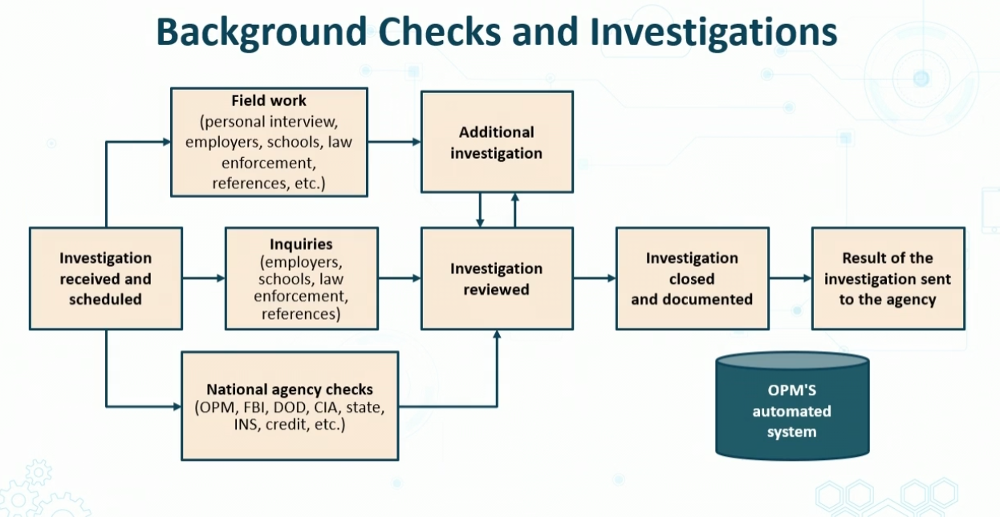

# Personnel Policies

## NDAs
- legal contract bw two parties
- Identifies confidential info
- restricts sharing
- Commonly used in interview process

## Background Checks and INvesitgaitons

## Onboarding
- Ramp up new or existing employees
- Provide assets guidance, knowledge, skills 
    - videos, printed material, CBT, etc
- Deliver sec awareness and AUP expectations
- Clearly define role
- Remove any ambiguity and uncertainy

## Automating Onboarding
- enterprises often deply systems that invovle self-service onboarding of personal devices
- emplyee registers new device, and the native supplicant is autopmatically provsioned for tha tuser, and device, and installed using supplicant profile that is preconfiguresd to connect the device to the corporate network
- offboarding is the reverse process

## Personnel Policies
- Change managemet process
- least privledge prolicy
- Mandatory policy
- Seperation duties
- Rotation of duties
- Clean disk policy
- Social Media usage

## AUP
- Condifere most improt sections
- Defines rules and behaviors
    - Language
    - illegal activities
    - avoid disturbing other systems
    - Do not reveal personal info
    - Do not reveal confidential info
- Identifies how emplyees are expected to use resources in the organization
    - Example:
        - Computer
        - mopbile device
        -sw
        - OS
        - USB
        - file transfer
        - remote access
        - telephony usage
        - Wireless LAB
        - Social Media usage
        - Cloud computing

## Standard Operating Procedure
- Step by step for carrying out tasks'
- Describe purpose and limits of procedures
- Offer all steps
-  Clarify concepts and terminology
- Consider health and safety issues
- List the location of all necessary supplmental resources

## Sec Awareness Training
- Involves steramin webinars
- Email bulleting
- Classroms
- Phishin campaings
- gamification
- Self paced training
- posters, mugs, mouse pads

> - should rep Org's misison and values
> - all applicable polcies
> - Ecamples:
>   - password and badge policy
>   - tailgating/piggy  bakcing
>   - Social engineering and phishing awareness
>   - DLP
>   - rules and regulations

## Role based Training
- General users
- Data systems and ownersd
- Data custodians
- Admins
- Privleged users
- Executive users

## Emplyee Release and Exit Interviews
- Identify factors that led employee to leaving
    - how can org improve to keep employees
- Remind exiting employee of their agreements and responsibilities
    - review NDA they signed
    - remind them o fwhat theyre forbidden to discuss with others
- Adhere to well-defined offboarding sec polcies

# Third Party Risk Management

- BPA - business partners agreement
    - purpose of business
    - contributions
    - rights and responsibilities
- SLA - service level agreement
    - official commitment beween provider and consumer
    - Defines quality 
- OLA - organizational level agreemtn
    - internal version of SLA
- ISA - interconnectionsecurity agreement
     - Documents that formalizes connections between two orgs
     - Defines security and safegaurds for the connections
     - AWS direct connect
- MOU/A - moemorandum of understandin or agreemtent
    - defines pre-agreement parameters and commitemetn bw two parties
    - generally non-binding declaration of intenet or responsibilties of each party

## Measurement System Analsysis (MSA)
- MAthematical technique for deciphering degree of deviation that occurs when using a measurement process
- Often used to endorse a measurement system by evaluating correctness precision and strength

## Third Party Risk Factors
- Vendors and supplier reliability
- Supply chain quality and security
- Business partner privacy vulerability
- End Of Life products
- End of service posture

# Data Policies

## Labeling and Classification
- also called "Sensitivity Levels" 
- USed for classification of data, information, and logical/physical assets
    - can invovle physical asset tagging and inventory systems
    - Virtual tags case sensitive key-value pairs store in config mgmt doc/NoSql DB
- Assists in detmeirning priority and protections based on risk tolerance
    - Avoidance, acceptance, etc

### Attributes for Labeling
- Monetary Value
- Age
- Utility
- Personal Association (PII,PHI)

## Classification Schemes
 ### Military
 - Top secret
 - Secret
 - Secret But Unclassified (SBU)
 - Confidential
 - Uncalssified

 ### Commercial
 - Corporate Confidential
 - Personal Confidential
 - Trade secret/propietary
 - Private
 - Public

## Handling
- contrrols who has access to info
- Can be base don 
    - class
    - sensitivity levels
    - risk treatment

## Data rols
- Owners
    - creator of data
- Steward
    - manages data or metadata from business perspective
- Custodian
    - keeper of info from tehcnical perspective
        - making sure it is available
- C-suite

## Data Retention
- Keeping data until it is not longer needed
- Policies identify how where and why data will be retained

Destruction
- Burning
- Shredding
- Pulverizing
- Pulping

Sanitaiton
- Degaussing
- Purging
- Wiping
- Encrpytion

## Credential Policies
- 