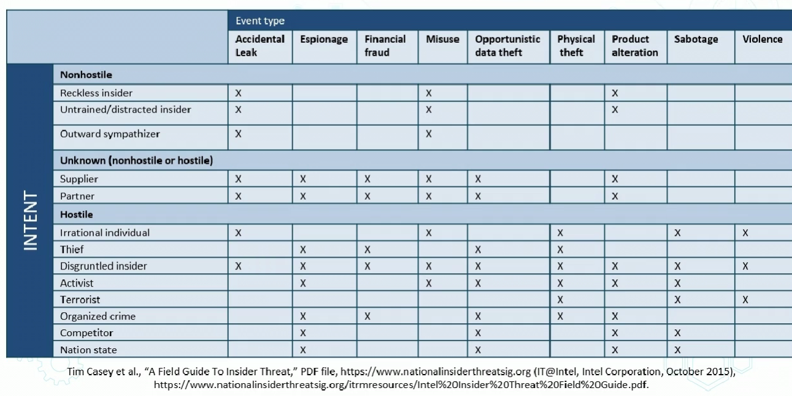
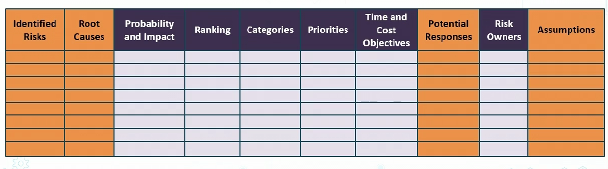
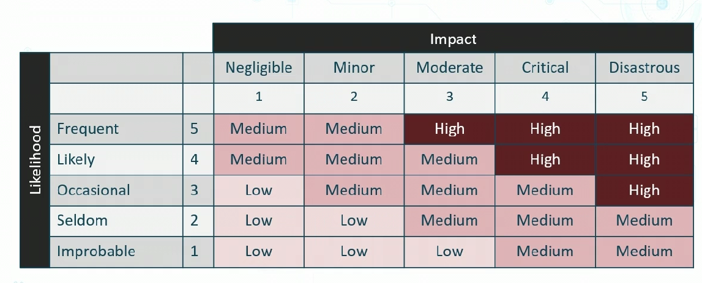

# Risk Types

## Structured v Unstructured Threats
- Structured
    - Planned
    - Organized
    - Persistent
        - long term
    - Multi-phased
    - Can be internal or external
    - Exploit kits, zero-days, modules, ransomware
- Unstructured
    - Accidental
    - Non malicious
    - Drive-by web surfing
    - no AUP
    - Poor awareness
    - Email
    - USBs and personal electronics

## Internal Risk

- poor physical security
- Lack of MFA
- Non enforcement of sec policy
- Substandard auditing
- Poor patch, config, and ahcnge mgmt
- Lack fo automated vuln assessment
- absence of endpoint detection and response tools

## Risk and Threat Matrix

## Multiparty Risk
- Orgs tha top with outsourcing
- Frequency has grown to outsource
- There is greater regulatory emphasis on how orgs manage third parties 

# Risk management strategies

- Risk Acceptance
    - may not be accepted for all scenarios
    - Means we do not implement any safeguards
        - Justification in writing is foten required
- Risk Avoidance
    - choose not to undertake actionst hat introduce risk
- Risk transference/sharing
    - pass risk to third party like insurance or CSP
- Risk mitigation
    - implement safegaurds that eliminates or reduces risk exposure
        - risk may exist but impact is reduced

# Risk Aalsysis

- Risk is:
    - Inherent (total) risk
        - Risk orgs face if safeguard is not implemented
    - Residual risk
        - risk that remains when safegaurd is in place
    - Residueal = inherent risk - controls (safeguards)

## Asessing Risk

- What are your assets at risk?
- Inventory and cateogrization
    - Both tangible and intangible
    - Value
        - maintenance/replacement, liabilities
- Risk to those assets
    - Vulnerabiltiy to threats
    - Who, why, how?
        - how subject are you to anything
- Only focus on most likely
    - Maximize available resources
    - Focus on most likely to least likely

## Risk Ledger/Register
- can be scatter plot or table
- Fulfills regulatory compliance
    - Repository of identified risks, impact, scenarios, and potential responses

## Qualitative Risk Analsysis
- Descriptive approave using subjective opinions, history and scenarios to detemine risk
    - Expert judgement
    - BEst practices
    - Intuition
- Often involves inerviewing people on threats, risks etc

## QUantitative Risk Analysis
- Scientific approach
    - Asset Values
    - Impact and magnitue
        - severity of incident
    - Probability and likelihood
        - threat frequency
    - Costs and effectiveness of safeguards
    - Probabilities based on percentages and calibrated estimation
    
## Classic Quantitative Analysis
- AV asset value
- Exposure Factor
    - % og asset loss cause by identified threat
- Single Loss expectancy
    - potential loss if attack occurs
    - (Asset value * exposure factor)
- ARO (annualized rate of occurance)
    - estimated frequency of threat for a year
- Annualized Loss Epxectancy 
    - SLE * ARO

# Disaster Types and Classifications

- Environmental
- Man-made intentional
    - arson
    - terrorist
    - theft
- Man-made unintentional
    - msitakes
    - power outage
    - Pandemics
    - Information disclosure
    - coding error

# Business Impact Analysis

- Risk assesmment aspect of BCP
    - identify critical functions to the business and prioritize based on need for survival
- Identify risks associated with the following critical functions
    - probabiltiy of risk occurring  (likelihood)
    - impact risk will have (magnitude)
- Identify how to eliminate or reduce risk

## Recovery Time Objective (RTO)
- Amt of time available to recover
    - must be equal or less to MTD
- ANy solutions must be accomplished within this time frame or it is considered a loss
    - add physical sec
    -  add redundancy
    - purchase insurance
    - invest in backup generators
    - Safeguard media off-site

## Recovery Point Objective
- Point in time where process recover begins
    - how much work can be lost if a disruption occurs?
    - what impact will it have?
    - How do we make sure we dont lose more than "X" information

## Meantime Between Failures (MTBF)
- Meausure of hwo relaible a hw system or componenet is
- for most devices, the measure in thousands or tens of thousands of hours between failures
- For example, an SSD drive may have a MTBF of 10 yrs

## Mean Time to Repair
- how long does it take to repair?
    - measure time to fix
    - Avg value predicted on experience and docs
    - (total down time) / (number of breakdowns)

## Maximum Tolerable Downtime (MTD)
- Absolute max downtime before experiencing loss
    - finances
    - life line
    - regulatory
    - reputation

# Privacy breach Consequences

Causes:
- Cyber attacks
- Device loss or theft
- Employee leakge or theft
- Human errors

Privacy breaches have Impacts on:
>- productivity
>- Response
>   - expenses for that response
>- Replacement
>   - value
>- fines and judgements
>   - legal defense cost
>- Competitive advantage
>- Reputation

# Data Type Classification

## Military Classifications
- Top Secret
- Secret
- Sensitive but unclassified (SBU)
- Confidential (lowest level of class)
- Unclassified
    - would be redacted of controlled data

## Commercial Classifications
- Corporate COnfidential
- Personal confidential
- Trade secret/propietary
- Private
- Public

# Data Security Roles and Responsibilties

- Chief Privacy Officer
    - ensure privacy of data in entire org
- Owner
    - determines classification level
- Steward
    - manager of data and metadata
    - Ensure compliance (standards/controls) and data quality
- Custodian
    - keeper of info
    - Ensures CIA is maintained
- Processors
    - handles data entry and input

# Privacy Enhancing Tech

## Tokenization for Privacy Enchancement
- Technique used to remove directly identifying elements
- Process replaces the raw data with randomly generated tokens 
- Most often deployed with structured data like payment cards or Social Security Numbers
- Original data does not leave enterprise in order to meet regulatory req's
- Tokenization + ENcryption can be used together for defense in depth

## Data Minimization for Privacy
- Directive that data should not be kept unless necessary
- Details should be determined early in lifecycle to support data privacy standards like GDPR

## Masking and ANonymization
- Involves stripiing out or replacing data that can identify subject
- PII
- PHI
- PCI-DSS (Credit card payments)
- Intellectucal property (ITAR and EAR)

# Additional Privacy Concepts
- Info life cycle
    - for Data at Restit goes through a life cycle
    - this is to move to different data over time
    - SHould be planned out and orchestrated
- Impact Assessment
    - must be concerned with data loss and data leakage
- Terms of agreement
    - when moving data you need to understand the shared responsibility 
    - private agreements maya lso come up
- Privacy notices
    - they notify how they will deal with your personal data
    - may come intermittently with updates
-
