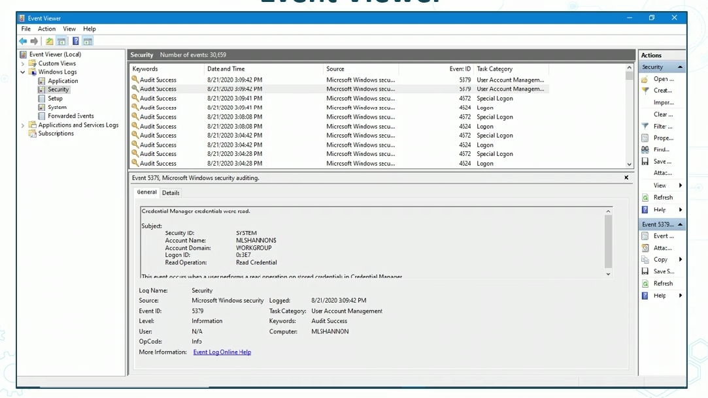

# Windows Logging and Monitoring

## Event Viewer

## System log

## Process Hacker

## Secure Configuration Assessment (SCA)

- program where we can configure for hardening

## Automate Monitoring with powershell

## Solar Winds
- Provides lots of products for Network Mgmt
- Syst MGMT
- IT Sec
- IT service mgmt
- App Mgmt

# Linux Logging and Monitoring

## Linux Logging Utilities
- syslog-ng 
    - Newer replacement for syslog in many builds
    - Takes logs mssgs and fwds them using powerful filters
- syslogd
    - readsnand logs mssgs to system console designated by config file
- log rotate
    - offers auto rotation, compression, disposal and emailing of log files
    - each log file an be handled daily, weeklymonthly, or when too large

## Auditd
- RHEL and SEL logging
    - cmd execute
    - file dir access
    - network connections
- Rules managed by audit.rules file or the auditctl command
- ausearch, aureport, and autrace tools

## Linux ls -l
- to build basline, show files, and find deviations

## Netstat
- shows malicious connections

## ps -ef
- shows processes
    - also to find malicous processes

## top
- shows baselines of processes
- associated with CPUs and more

# Protocol Analyzer Ouput

## Wireshark
- can see network traffic real-time
- can also see historical files
- shows TCP and UDP stacks

# Cloud COmputer Logging and Reporting
- AWS has many services for logging 
- All CSP have enhanced tools

>- cloudwatch and cloutrail
>   - cloudtrail shows API calles
>- VPC Flow Logs
>   - give you vizualization of IP addresses
>- AWS COnfig
>- Systems Manager
>- GuardDuty
>   - MSSP

## Aws CloudWatch
- Provides dashboard for access to your resources
- can also set up alarms and event triggers

## AWS Systems Manager
- gives orchestration and reporting automation

# Log Aggregation and Collection

- Gather logs and alerts form many sources 
    - various logs, (sys, app, FW, sensors)
    - SNMP traps
    - Netflow collection V9 preferred
    - Next-Gen IPS
    - DB activity monitors
    - VPN Gateway Flow Logs
    - Next Gen syslog tools
    - Cloud-based visibility tools

## App Log Aggreations
- Input validation
- Authentication attempts + failures
- Access control failures
- Tampering
- Use of invalid or expired session tokens
- Exceptions raised by OS or programs
- Use of admin rights
- TLS failures

## Visbility and Reporting Best practices

- Visibility =/= Reporting
- Collect all reports from vuln scans and pen testing
    - then visualize results for non-tech execs
- Reports should have as much info as neccessary w/o data overload
- May need to express in simpler terms
- Dashboards are very effective

- Understand importance of visual communications
    - avoid 3-d 
    - Use pallets of colors
    - Avoid PIE charts

- CSP tools
- R programming and ptyhon
- Automated system reports
- PDF files
- Charts and graphs
- Dhasboards for visibility
- Written summaries
- After-action reports
    - include lessons learned section

# LEssons Learned and After-action reports
- knowledge gained from process
- Formal lessons leardned usually at project close-out
- Recognized and documented at any point during lifecycle
- Purpose is:
    - share knowledge derived from an experience
    - Endorse recurrence of positives
    - prevent negatives

## Incident Repsonse Reporting
- Root cause analysis
    - Examines core reasons for incident or failure
    - Phases: collect, record, analyze, and then reccomment
- IR after-action report
    - any type of retroactive analysis of series of goal-priented activities typically performed by originators of excercises
    - ANalytic AARS have 3 key goals
        1. indetify issues
        1. recommending measures to counteract challenges
        1. finding "lessons learned"

## Forensic Reporting
- meet with proper authorities
    - provide docs of all findings
    - provide testimony
    - provide clarification
    - Identify impact
    - Recommend any countermeasures
- Tracking people hours and expenses
    - who, what, how
        - important for court and other proceedings

## After Action Report
1. Overview
2. Stated Objectives
3. Anslysis of results
4. Analysis of critical task performance
5. Summary
6. Recommndations

