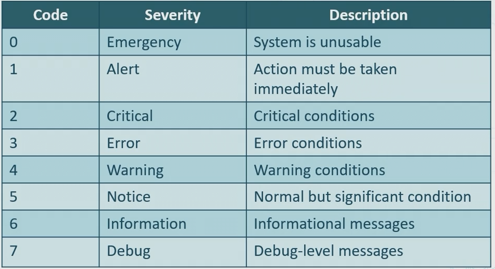
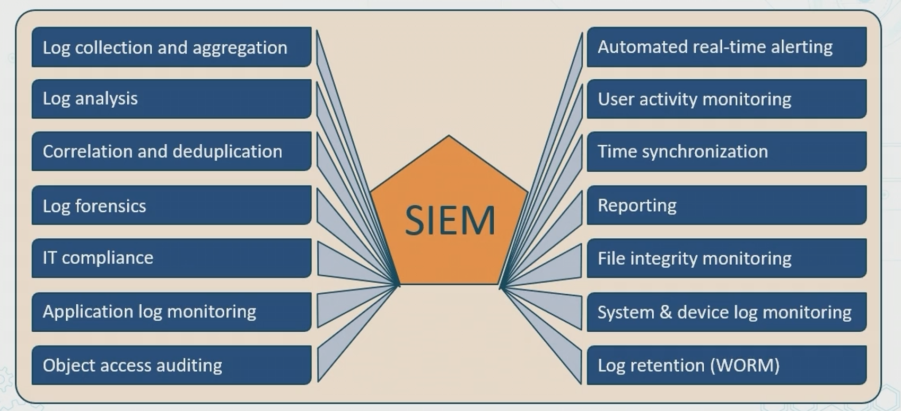

# Security Assessment & Penetration Testing Techniques

# Threat Hunting
Involves cyber investigators seeking out threats
> - often compliance or regulatory auditors
> - Attempt to recognize anamolies and discover historic patterns in data and IoCs to counter/mitigate threats

* Team members often dig through data and fix sec progllems, repair vulnerabilities
* Big data security analytics often generate metrics for collecting/visualizing results

Threat hunting involves
1. Intelligence fusion - seking threats
2. threat feeds - info gathering
3. Advisories - alerts from various vendors and orgs like @RISK from SANS

# Vulnerability Scanning Terms
 - Process of indentifying known and unkown weaknesses in systems, application, services and policies using tools
 - Often more focused process looking for unpatches systems, misconfigs or open ports
 - Typically automated and done routinely

Different results possible:
> True Positive = accurate + action taken
>
> True Negative = accurate + action NOT taken
>
> False Positive = error + action taken
>
> False Negative = error + action not taken

Sources Include:
> Logs
>
>Simple Netowrk Management Protocol traps and informs
>
> Netflow v5 and v9 Collection
>
> Security Information and Event Management SIEM systems
>
> Security Orchestration Automation and Response (SOAR)

## CVE 
> List of entities from MITRE that reps vulnerabilities
> 
> used by National VUlnerability Database
>

## CVSS 
> Open standard for weigin computer system vulnerabilities 

## Web Vulnerability Scanning
> Most common vuln scanners look for:
> * Cross-site scripting and request forgery
> * SQL injections
> * Broken authentation and sessions managemetn
> * Insecure server configs
> * Exposing sensitive data

# Vulnerability Scanning Tools

> Common ones are:
>
> Nessus
>
> OpenVAS
>
> Nexpose
>
> GFI LanGuard
>
>QualysGuard
>
> OWASP ZAP
>
> Burp Suite

> * Network scanners scan IPs and present info in XML view
>
> * Most provide network montoring and detect outages
>
> * Active Malware worms are also considered network scanners

Some of the scanners cna be used for compliance scanning
* Carring this oneis different from Vulenrability scan

* Decides of system is configred with a policy

* Sometimes involves more sensitive data and systems

* These compliance can be minimal baselines

* Differe between financial and government requirements

* Need to be in line with business goals.

# System Logging with Syslogj

> standard established in RFC 5424
>
> * Typically sends informational event messages to sys log server or SIEM system
>
> * Used to gather various logs in centralized fashion
>
> * uses UDP 514 or TCP 1468 (informs)

## Severity Values of Logs
> 
> **NOTE:** Default is usually 7

Need to look at sample syslog messages

## SIEM
> Centralize storage and analysis of logs for real time analysis

> Can send filtered data to miniing/warehousing data cetners

> Allow sec professionals to take countermeasures, perform rapid actions etc

> SIEM data sources include:
>
> * Firewalls and IPS
> * Security Appliances
> * Infastructure devices
> * Enpoints and Servers

