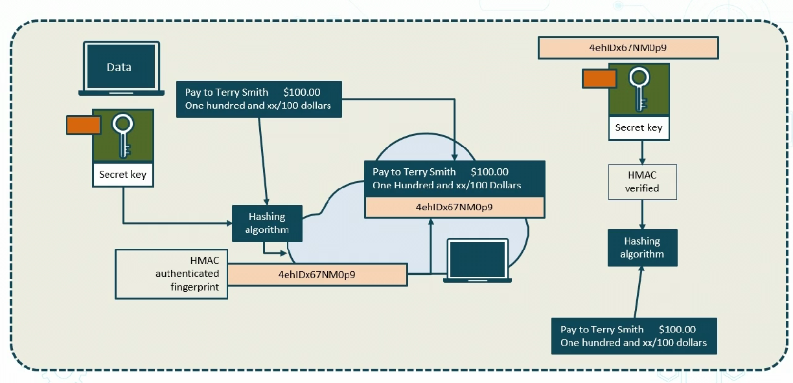
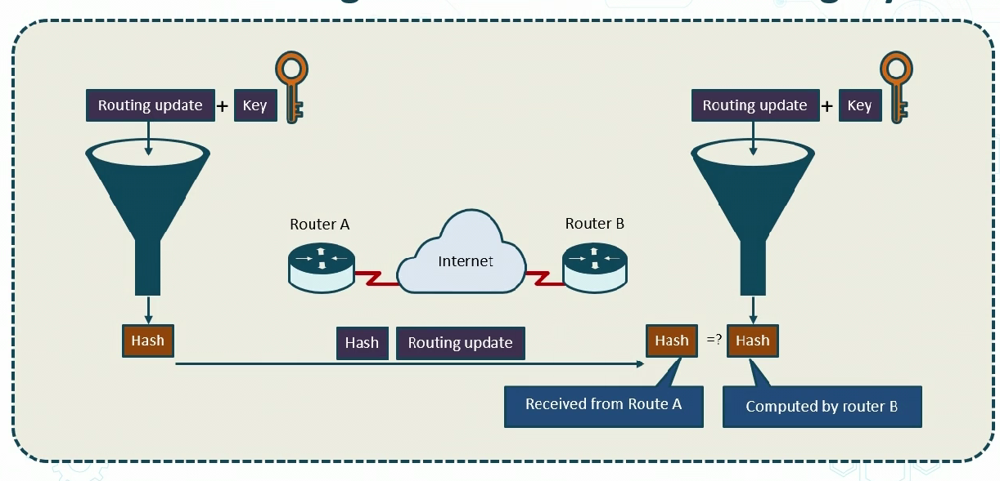
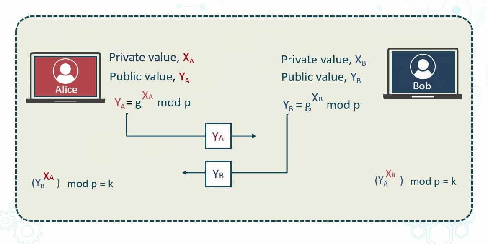
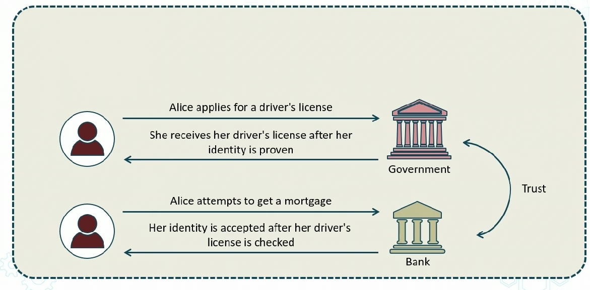
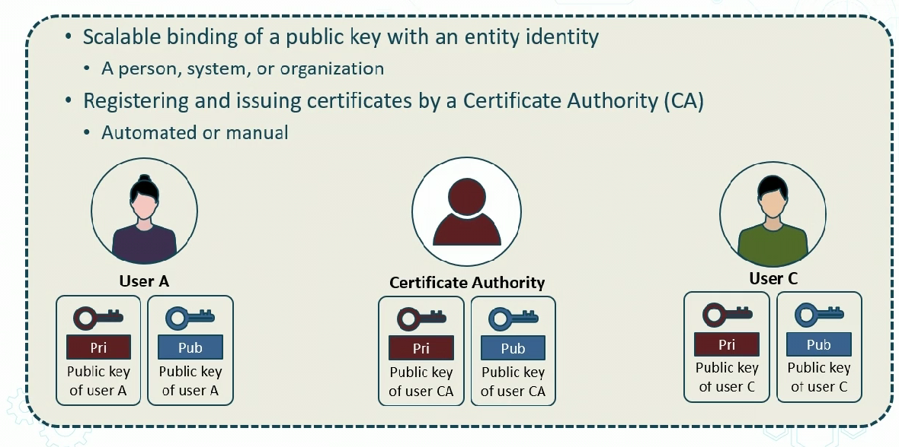
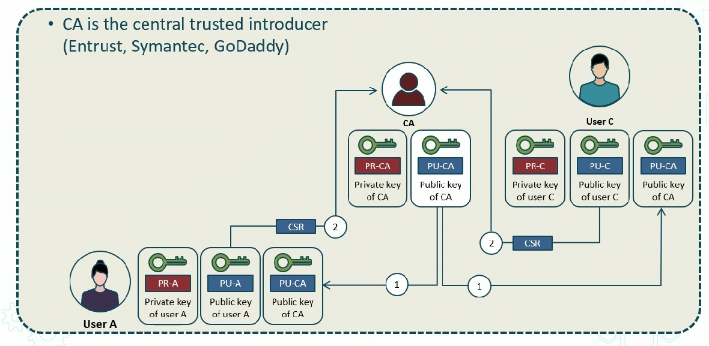
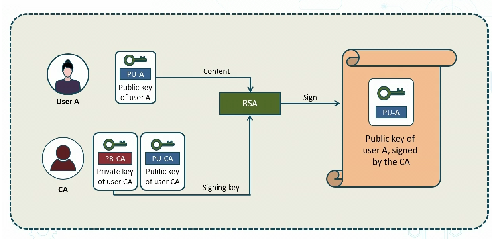
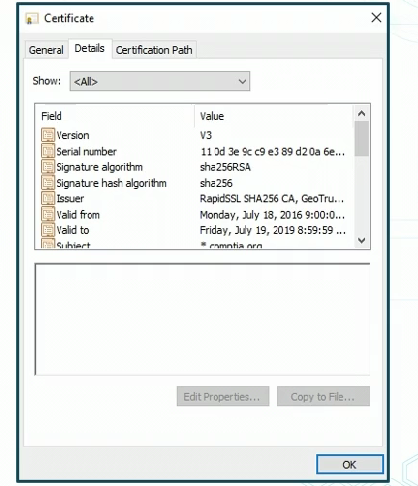

# Symmetric v Asymmetric Crytography

Cryptography
- study fo securing comms
- encryption /hashing/signing
- involves new systems and new variants

Cryptanalysis
- study and practice of exploiting weaknesses in comms
- Explore:
    - bruteforce
    - implemetation attacks
    - side-channel attacks

## Services

Confidnetiality
- hiding data at rest transit or in use

Integrity
- ensure data has not been altered

Availability
- protecting systems from flooding DdOS techniques

Non repudiation
- ensures og sender cannot deny sending data or engaging in a digital transaction

## Multiple layers for Encryption

## Ciphers
- an algo used for encrypt
- outline prodcures
- result is cipher text
- many types
-  modern siphers use combo of diffusion, transpoition and confusion techniques

## Symmetric
- uses saem key to deceypt and encrypt
- effiecnt and fast
- computationally inexpensive
- usually short key lengths
- more complex key managemetn
- more difficult to secure
- no origin auth
- dont scale well

## Assymetric
- use mathematically related pair of keys
- one encrypt another to decrypt
- allows good key managemetn
- great for signature
- high scalable
- computationally expensive

Example
- confidentiality encrypts with public key, deccrypt with priv key
- origin auth: encypt with priv key and decrypt w/ public key

# Characteristice of Cryptographic Keys
- Keys are sets of chars used to convert plaintext to cipher
- only elemetn tha tis secret in a sound cryptosystem
- kespace represents total unmber of possibilities
- lengths vary from 56 to 4096 bits

## Uses
- ecnryption
- hash function
- digital sigs
- message auth codes

> can be static
    - for long periods of time
    - for differe processes

Session Keys
- single use for entire session
- decrpyt/encrypt all mssgs
- limits info encrypted
- makes many attacks more diff

Ephemeral 
- very short time
- used only for only one key estavlishment process
- never retained

## Key Streching
- PNKDF2 BCRPYT programs are seudorandom functions to salt passwords
 - kerberos uses 4096 of key streching

## Key Mangement
- symmetric systems are more vulnerable
- only auth persons should be involved in life cycle
- long term storage done by cloud
- removing keys from operation

BIG weakness is poor human implementation

# Ciphers

- many types
- used for ecnrypt/decrypt

## block Cipher Suites

- operates on fixed sized
- mssgs bigger than block get broken up

## CBC Cipher Block Chaining
## COUNTER MODE (CTM)
## AES IN GCM mode
- gives authenticated encrypt and decrypt

## Stream Ciphers
- operate on contninous stream of plaintext data by ecnypting one bit at a time
- plaintext bits XORed with keystream bits
- faster and less complex than block ciphers
- modern ciphers work block/stream/both
- 

# Cryptographic Hashing 

> - Maps data of any size to fingerprint/Hash value
- Advanced verion of Simple Checksum
    - used to make sure data isnt corrupted
- Mathematical one-way function that produces digest of 128 to 512 bit
    - usually appended to data of arbitrary length
- Birthday Paradox
    - hash function is only half as strong as the length (128 bit ahsh function only 64 bit strong)
- Avalanche effect
    - one bit change changes everything else in the hash 

## Cryptographic Hash Functions
- MD5 (128 bit digest)
    - dont use it
- SHA-1 (160 bit digest)
- SHA-2 (SHA-256 or SHA-512) and SHA-3 (224-512)
- RIPEMD (128, 160, 256, 320 bit versions)

## Origin Authentication with HMAC

- Hashed Message Authentication Codes (HMAC) verify sender of info
- hashing + secret key (MAC)
- msg + hash + key 

## HMAC for data integrity and authenticity

# Key Exchange Mechanisms

Cryptographic means are possible to provide shared keys over untrusted networks

- Asymmetric key exchange
    - RSA - key exchange
    - Diffie- Hellman - key agreement
    - Elliptic Curve Diffie Hellman

## Diffie Hellman

- DHKE and RSA Key transport are og protocols for establishing secret keys over unsecure channel
- DIFFIE Hellman used in SSH2 TLS and IPSec
- Reps application of discrete logarithm problem

## Diffie Hellman Key Exchange

### Diffie-Hellman Modes
- DH mode
- DHE (Ephemeral)
- ECDH (Elliptic Curve)
- Elleiptic Curve Ephemeral
    - used on transport layer 
### Elliptical
- Rich math funcs
    - vals of pts on curve used in formula for encrypt/decrypt
- Most efficient
    - smaller keys with good strencth
    - 3072 standard keys = 256 elliptic curve key
- excellent for mobile devices and IoT
- Uses
    - digital sigs
    - key distro
    - encryption
    - IpSec and TLS

# Modes of Operation

Crypto systems can be:
> - authenticated
> - Unauthenticated
> - Counter
> - ephemeral
>   - foward secrecy
> - perfect foward secrecy
> - Lightweight Cryptography

## Perfect Foward Secrecy
- also "foward secrecy"
- if compromise of long-term keys does not allow an attacker to obtain past session keys
- public-key crypto system has optional prop of fwd secrecy when it generatoes one random secret key per session to complete a key agreement without using a deterministic algorithm

## Lightweight Cryptography
- Sensor networks, healthcare, distrubted control systems, IOT, 
- Usually communicating wirelessly and working together to complete tasks

# Advanced Cryptographic Concepts

## Digital Signatures

- Scalable mechanism for providing authentication, integrity and non-repudiation
    - no confidentiality
- Equivalent to a handwritten sig in many countries
- Random priv/pub key pair (usually RSA)
- SHA1/2/3 hash algo
- Signing algos:
    - RSA
    - DSA-
    - ECDSA

## Quantum Computing
- uses cubits (instead of 1s and 0s)
- quantum computing derives form qubits being combo of 1s and 0s at any given time
- ability to simultaneously be in multiple states

## Post-Quantum Computing
- developing new cryptosystems that can be implemented using todays computers but resistent to future quanntum computers

## Quantum Comms
- uses quantum physics to protect data
- some orgs use Quantum Key Distro QKD
- QKD sends data as normal bits on network while decryption key info is encoded and transmitted in a quantum state using qubits
- theoretically ultra-secure

## Homomorphic Encryption
- protecting data in memory
- data remains encrypted while being processed
- CSPs can apply functions on encrypted data
- Commonldy uses pub/priv keys
- use algebrais ops on ciphertext

## Blockchain
- public ledger with digital "chain of blocks" storing info
    - transaction date
    - participants
    - unique hashes that distinguish blocks
- To add block
    - transaction must happent
    - must be verified
    - must be stored in a block and given a hash

# Common Use Cases and Limitations

## Use cases

- low power devices need low latency and high resiliency
    - introduces need for elliptic curve and light wegith crypto
- must support
    - confidentiality
    - integrity
    - obfuscation
    - authentication
    - non repudiation
## Common Limitation
- Speed
    - symmetric is fast
    - assymetric is super slow because of key space
- size
- weak keys
- time
    - all cryptanalysis can overcome it with time
- longetivity
    - longer key is used, it susceptible to brute force
- predictability
    - using common keys can mess you up
- resuse
    - reusing keys/passwords
        - should use history to prevent easily guessed
- entropy
    - add randomness to remove structure in messages
- computational overhead
- resources

# Public Key Infastructure

## Trusted Third Parties

**PKI** distributes, verifies and revokes public keys in a way that is secure and scalable
- extensible trusted 3rd party architecture

## PKI

- Scalable binding of a public key with an entity identity
    - person or org
- registering and issuing certificated by Certificate Authority (CA)
    - automated or manual

- in this example assume *Entrust* is CA aka central trusted introducer
    - there is web of trust between the CA's
- Everyone has the public key of the CA
- CA has public key of customers
- CSR = Certificate Signing Request
    - CA's have self signing certificates
        - these are highly secured
    - technically, any CA can generate certificates for anyone who wants one 
        - could be an issue
- After recieving certs, users can exchange them with each other

# Types of Certificates
Most hosts have two certificates, their own, an *identity* certificate, and **root certificate** of CA's
## X.509v3 Certificate Format
This is a format form the CA
- version
- serial number
    - used to be series of numbers in order
    - now it is psuedo random
    - important to revoke it
- Signature algorithm ID
- issuer name
- validity period
    - not before/after
- Subject name
- Subject public key info 
    - public key algo
    - subject pub key
- issuer unique identifier
- subject unique identifier
- extensions (*field*)
    - to make things faster or support newer protocols on internet
    - fields to add extensibility
- Certificate signature algorithm
- Certificate signature

## X.509v3 Certificate Extensions (*file type*)

- DER
    - binary encoding of definitive length form
- CER
    - binary using indefinite length
- PEM (Privacy enchanced Electronic Mail)
    - base64 encoded DER cert
- PFX
    - predessor of PKCS#12
- P12 (PKCS#12)
    standard used for exchanging public and private objects like keys
- P7B (PKCS#7)
    - used for signing/encrypting data

## Types of Certificates (within X.509v3)

- Wildcard
    - used w/ subdomains
        - *.mycompany.com
        - this way you don't have people use your subdomain somehow
- SAN (Subject Alternat Name)
    - used to associate names based on email address, IP, DNS
- Code signing
    - authenticate source and integrity of code
    - Drivers, apps, macros, configs etc

## Certificates (types)

- Self signed
    - signined by entity it certifies
    - Root CA's use these
    - also for lab, but not public use
- Root
    - unsigned or self signed that identifies the roort CA
    - Trust anchor for digital certs in chain of trust
        - can have many
- E-Mail (S/MIME)
    - used to sign and encrpypt email messages
- Machine/PC
    - used by local machine or device
    - Authenticate to network
- User
    - used by individual user entity
    - EFS (encrypted file system), email, client authentication

## Certificate Validation

> 3 Ways to validate:
> - Domain Validation
>   - provides proof over the control fo domain using email or domain registry check (WHOIS)
> - Organization Validated
>   - Certificated require more validation than DV certs, but provide more trust
> - Extended Validation
>   - profive max amt of trust to visitors with green padlock

# Core PKI Concepts

## CA Trust Models
- Single CA
    - Responsible for provoding Certs to everyone (enterprise PKI)
    - example win server on AD
        - directly responsible to provide Certs
    - Must always be online
- Hierarchal
    - root CA, and Intermediate CAs
    - Root provides certs to intermediate CAs
    - intermediates provide certs and the "chain" to users or other 
- Root can be online or offline
    - online - connected to network andissues certs over network
    - offline - issues certs on removable media (more secure)

## CA Certificate Chaining
- How do I trust cert?
    - CA must be in truster store
- Not possible to include all CAs
- A chain of trust
    - *issued to* field
    - *issued by* field

## Certificate Revocation and Suspension

- For sec reasons, all keys must have finte life for brute force
    - verts stamped with non deterministic serial nums and validity dates
- Certs can be
    - revoked
    - suspended
- Extensions fields are critical for functionality and security

## Certificate Revocation List (CRL)
- list of cert erial nums no longer valid or revoked
- Issued by CA who issued cert
- Generated and published perioudically
    - defined intervals, or immediately,
        - not realtime
    - Downloaded by client regularly
        - not real time
    - Not realtime == vulnerable

## OCSP (Online Certificate Status Protocol)
- list of certs that not valid
    - serial nums
- Generated and published immediately
    - online db
    - clients query 24/7
    - can be anyone, but a lot dont check

## Certificate Stapling

- OCSP stapling/TLS cert status request
- Alternate approach of checking reovation status of cert
    - client doesnt contact CA
    - Certain contains a time-stamped OCSP response
        - signed by CA
        - owner of cert bears cost

## Certificate Pinning
- manual "allow list" of certs
    - supplements or replaces chaing of trust
    - Improves cert sec
        - only pinned certs are trusted
        - google pinned it own web sites in chrome
- Pin during app dev or after it is leanred
- Pin when you need to be 100% sure of remote host identity
- Cert pinnin v public key pinning (more flexible, only key is pinned, from Certificate)

## Common Crypotgraphic Use Cases / best practiced
- used trusted third partty CA services
- use fully tested enterprise CA
- Validated cert chains
- Consider OCSP for revocation
- Eliminate risky manual key management
- Tightly enforce key management policies
- Used 3rd party cloud based MSSP services

