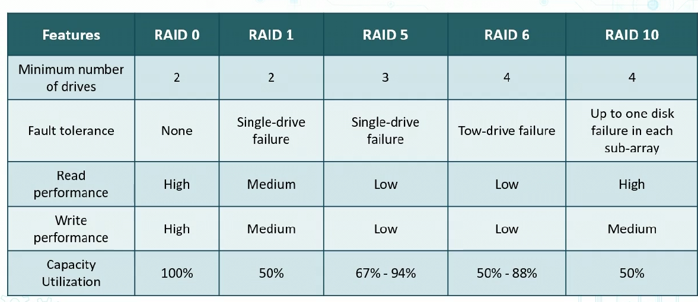

# Redunancy Concepts
- Passive Redunancy uses additional capacity to reduce componenet of failuer
    - Active/passive failover
    - Hot spares
    - Snapshots
        - snapshots of storage and hard drives (virtual)
- Active Redunancy eliminates perfomance problems by having simultaneous capacity in use
    - Active/Active failover
    - Hot sites

### Geographi Dispersal
- Proper disperal of data is key
    - ie storing spare physical componenet offsite (disaster recovery)

Example: Cloud (AWS)
- Break it down to N. Virginia 
    - Then there are Avaialbility Zones, at least 2 data centers across a metro region
    - Services can be deployed in at least 2 AZ's

### Redunant Array of Independent Disks (RAID)

- RAID 0
    - Data split into blcoks
    - Blocks written across all drives
    - Use at least 2 disks
    - offers fast R/W speed
    - Not redundant = no fault tolerance
    - Use Cases
        - Cacheing and data logging
        - High end workstations
- RAID 1 and RAID 10
    - Config of 2 drives that contain exact same data
    - one fails, others pick up
    - Offers high performance
    - Since data written everywhere, write is slower
    - Use Case
        - for high availability and durability
        - OS and Databases
- RAID 5
    - At least 3 drives
    - Like raid 0 is stripped, but has "parity" data
    - in failure, data restored using parity info
    - read time fast, but write slow bc Parity calculations
    - Most popular RAID 5 config use 4 drives
        - lowers lost storage space to 25 percent (can work with up to 16)
    - For web servers, archiving and zero down time when done correctly
- RAID 6
    - like RAID 5, but parity written to two drives (requires atleast 4 drives)
    - Solution can survive 2 simultaneous failures
    - Read fast, but slow write than RAID 5 bc additional parity data calculated
- RAID 10
    - Mirroring + Striping
    - Combo of Raid 0 and 1
    - Expensive way for redundancy

### RAID Comparisons

## Network Load Balancers
- Popular due to intensive use of aplications
    - Video streaming and file sharing
- Optimize app availability and perfomance
- Distribute traffice across servers
    - allows for failover solutions

### Load Balancing at Cloud Providers
- Netowrk or app load balancing
- Health checks on virtual instances
- Produces flow logs for visibility reports
- runs SSL/TLS listener
- Can have firewalls applied

### NIC Teaming
- Virtual switch with Cirtual NICS connected to TEAMS
- Group up NICS
- Physcial or Virtual
- From 1 to 32 adapters
- Provides fault tolerance

### Redundant Power
- Uninterruptible Power Supplies (UPS)
- Generators
- Managed Power Distribution Units (PDUs)
     - into rack and amanged over ethernet w/ management station

# Replication Methods

### Replication w/ SAN
- Storage Area Network is dedicated independent high perfoamcne network that connect storage devices to multiple servers
- Moves sotrage resources off main user LAN so that each server can access shared storage
- A host will send block based access request for access

### SAN Componenets
- Ehternet or fiber
- Host bus adapters
- Storage arrays
- SAN Switches

### Securing the Storage Area Network
- use IP sec AH for integrity and origin authentication
- MACsec can give encryption
- Use secure management procols on console
- Harden all switches and servers
- Encrypt w/ AES-256-GCM

### Virtualization
- Process of running virtual isntance of CPU in layer abstracted from hardware server
- Running multiple OS on a CPU
- Apps running on top of VM, seems like it's own OS

### Hypervisors
- SW that runs VM
- Controls interaction b/w VM and hardware
- Type I - bare metal
    - XenServer, KVM, Hyper-V, ESXi
- Tpe II -hoster
    - Runs on OS installed on HW
    - Virtual Box, VMware

### Virtualization Vulnerabilities
- VM Spwrawl
    - when VM overtakes admin ability to manage them
- VM Sprawl avoidance
    - Enforce strict process for deplying VM
    - Have library of VM images
    - Archive/recuycle under-utilized VMs
    - Use a VM lifecycle management tool 
- VM Escape
    - Serious where guest VM interacts with host OS
    - To protect
        - Patch VM and VM regularly
        - Only install what you need on host and guest
        - Install verified trusted apps only
        - use strong passwords

### Containers
- Isolated apps with all components
- Portable modules across platforms and cloud providers
- can be server0based or serverless in the cloud
    - Can be moved from testin to production fast
- Contribute to immutability and repid deployment concepts
- Docker and Kubernetes are common

# Back Up Types

## Full Back Ups
- Bakc up everything regardless of archive bit being set or not
    - CLears archive bit once back up completed
- Longest to back up
    - depends on how much gets backed up
- Quickest to restore
    - only most recent full back up req'd

## Incremental BU's
- any file that has archive bit set
    - any new file or changed file
    - clears archive file when BU'd
- Quickest to BU
    - Only files w/ archive bit backed up
- Slowest to restore
    - last full BU and every incremental BU since are req'd

 ## Differential BU
- BU's file with archive bit set
- Any new file or

