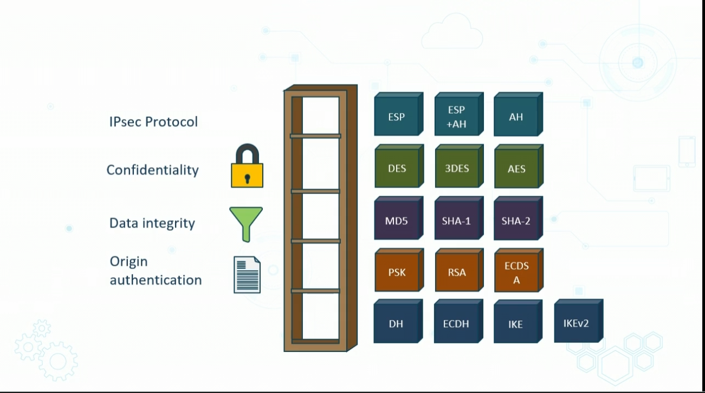

# Types of Secure Protocols

## Domain Name System Security Extension (DNSSEC) 

Protects users from DNS attacks

- add layer of trust on top of DNS providing authenticatio while root DNS name servers help verify domains
    - used Public key encryption
- to faciliate sig validation, adds new DNS record types
    - RRSIG - contains crypto sig
    - DNSKEY - contains pub signing key
    - DS - contains hash of DNSKEY record
    - NSEC and NSEC 3 - for denial of existence of DNS record
    - CNSKEY and CDS - for a chile zone requesting updated to DS records in Parent Zone
- DNSSEC
    - allows you to sign companys DNS records s.t. any system w/ authenticating DNS resolver automatically verifies if records valid, or have been compromised by man in the middle attack
    - does not provide confidentiality 
    - no DDOS protection
    - also called Open Umbrella
- SSH
    - on port 22
    - mgmt acces should be limited to secure protocols
        - IE SSH > TELNET
    - SSH2 > SSH1 
    - SSH2 uses symmetric encryption for bulk data and assymetic for key management 
- S/MIME
    - secure/multipurpose inernet mail echanger
    - SMTP not secure
    - S?MIME v3 is standard
    - provides dig signatures 
    - digital signature most common service of S/MIME

- Secure RTP
    - Secure Real Time Transport Protocol
        - extends RTP by prociding sec features
        - gives encryption, integrity, authentication
- LDAPS
    - based on X.500 but is lighter
    - easy to install,maintain, optimize, but not solid security
        - in comes LDAPS
    - it is LDAP over SSL/TLS
    - SASL Simple Authentication Layer / BIND offers Kerberos or client cert sent with TLS
- FTPS
    - FTP w/ SSL/TLS
    - extends FTP by adding SSL/TLS
    - Typically sderver to server
    - Using AES/RSA/DSA, and X509v3 certs
    - Explicit FTPS
        - select sections of encryption
    - Implicity FTPS
        - all parts encrypted
- SFTP
    - here Secure Shell (s is before)
    - IETF designed to provide secure data access and tranfer over SSH2 channel
    - function of SSH and is call SSH FTP
    - Both commands and data are encrypted
    - Platform independent
    - slower than SCP
- SNMPv3
    - Can be confidured in three modes:
        - noAuthNoPriv
            - no hash or encryption (password
        - AuthNoPriv
            - secure auth credentials and provide integrity, but no data encryption
        - AuthPriv
            - HMAC for integrity and secure authentication credentials, and encryption (AES) of data
- SSL/TLS
    - most uniquitous
    - TLS is standardized by IETF
    - most common is 1.2 (but 1.3 is most Recent)
    - used with SMTP, LDAP and POP3
    - Only mandatory cipher suite includes RSA for authentication, AES for confidentiality, and SHA for integrity and digital sigs

    - HTTPS
        - SSL/TLS
        - most widely used protocol on internet, for everything to be communicated securely
        - Mozilla deprecating non-HTTPS secured search results
        - Crypto exchange happen when you first connect
        - still possible to see what you visit, but not the web pages or data youexchange
        - padlock == TLS
        - Green icon is Extended Validation Certificate
    - POPS and IMAPS
        - POP and IMAP email protocols ruyn over SSL/TLKS
        - IMAP over SSL is 993
        - Encrypted POP3
            - requested after protocol initiation using STLS command
            - OR connected to server using SSL/TLS on well-known TCP port 995

# Features of IPSec

- IP Security
    - offers secure services to traffic b/w two or more trusted networks  
        - across untrusted stuff
- IPSec VPNS can also protect management traffic, as it crosses an org's intranet and b/w frontend backend 
- IPsec popular when connected to CSPs

## IPSec VPNs

- IPSec and SSL VPNS are both cryptography based VPNs
- two types of VPNs
    - SITE to Site and Remote access
- IPSec gives five functions
    - COnfidentiality (3DS, AES)
    - Data integrity (SHA1, SHA2)
    - Origin AUthentication
        - preshared keys or RSA or ECDSA
    - Anti-replay protection
        - verifies each packet is unique and not duplicated
    - Key management (IKEv!/2, DHKE, ECDHE)
- Operateds in tunnel or transport modes
    - transport used remotely, tunnel used between sites

## IPsec Security Suites
- IPsec is optional in IPV4
    - required in IPv6
> The blow shows options for different needs

# Types of Use Cases (IPSEC)
- Voice and video security
    - common touse TLS
- Time synchonization (NTPv3/4)
- Digitally signed API calls
- Routing and Switching
    - Peer authentication
    - can use 802.1 PNAC or 802.11AE MACsec
- Remote Access Sec
- Domain name reoslution (DNSSEC)
- email, web, internet file transfer
- Directory service (LDAPS and Kerberos)
- Netowrk address allocation (DHCPv6)

# Endpoint Protection

## Acceptable Use Policies

- most important aspect is the writen policies in AUP

## Physical Security

- Main cats
    - Admin
    - Technical
    - Physical
- end user has major role
- Can have:
    - computer locckling
    - Screen saver with storng pasowrds
    - Disable peripheals unsused
    - Adhere to AUP on removable media
    - use stron biometrics and MFA
    - smart cards and tokens
    - place electoronics in locked places
    - disconnect unused pcs
    - client side encrpytion responsibiltiy
    - protect printers and faxes

## AuthenticatioN tech
- Password/acces s keys
- smart card/token
- biometrics
- emreging tech

## HW/SW updates

- orgs allow end useres to be involved with upgreades sometimes
- if fully automated, end user can only at most potenntially postpone the process

## Personal System Updating

- update to most secure browser
- update programs
- update antiX SW
- install manufacturer firmware updates

## Personal Security Suites and Endpoint Protection

- all-in-one full scale security suite
- only one vendor to upgrade
- depending on sec vendor, may include two-way FW, parental control etc

## Web Browser Best Practices
- updated
- avoid extra plugins
- try to use HTTPS
- Choose EV validated sites if possible
- clear browser histories
- never store passwords in browser
- use pass word manager
- disbale pop ups
- use VPNs

## Email security funamentals

- rotating passwords involving four random words seperated by "-" or "."
- strong malware scanners
- never reply to spam
- gain expertise on recognizing phishing
- use MFA
- never open unknown atachments
- ONly send PI when neccessary
- use encrypted email
- acoid using emails in public wifi

## Protecting Data At Rest
- use crypto sw
- AES
- Steganography
    - to hide files
- Secure backups

## Endpoint Detection and Response tools

- detect suspicious activities and are indicators of compromise
- EDR tools monitor endpoing and netwrok events and send information to SIEM or centralized database for further reporting/analysis
- Key features
    - filtering
    - advanced blocking
    - incident response
    - multi-threat protection

## Next Generation Endpoint Protection
-
- IT Hygeine
- Next Gen AntiVirus
- Manged Hunting
    - elite team that finds things that automated tools cannot
- Threa intelligence
    - proactive alerts to threats
- Cloud-based architecture
    - MSSPs 

# Boot Integrity

- UEFI - Unified Extensible FIrmware Interface
    - replace slegacy BIOS
    - low level sw for boot time
    - tests hardware components (POST)
    - gets OS up and running
    - Offers ability to protect device at a low level with passwords
    - restrict people form booting
    - restrict people from booting from removable devices
    - prevents users from changing BIOS settings
    - prevents OS installs

# Databse ecurity

## Tokenization
- involves sending sensitive data through API call to provider that replcases data witrh non-senstive placeholders called tokens
- unlike encrypted data the tokenized data is irreversible and untangible

## Hashing

- replaces string w/ key that reps og string
- often for index and retrieving bc it is faster than og string

## Salting

- related to password hashing
- value appended
- value is "salt"
- protects against brute force

# Application Security

## Secure Coding Practives
- Verifying the input
    - also iunclude error handling
    - Errors shoul dbe captures with Secure Logging (SIUEM)
- Normalization
    - involves ensuring no redundancy in dtaa and that simialr items are stored together
- Stored procedures
    - groups of code that be used again
    - code reuse
- Obfuscation/camo
    - writing code that humans have a hard time understanding 
- Code signing (for proof of authorship)

## Securing Cookies
- orignially poorly designed
- Out of sync with browser same origin policy (SOP)
- cookie manipulation rampan
- need validate cookie integrity and deploy HTTP Strict Transport Security with subdomain coverage

## Securing HRTTP Headers from
- XSS
- Buffer overflows
- SQL Inject
- Path traversal exploits

## Whitelsiting/Blacklisting

- white listing implicitly denies all that is not whitelisted
- Blaclising uses stateles firewall rules to deny specific networking

## Analyzing Code
- Static Code analysis
- Dynamic Code Analysis
- Manual code review
- Fuzzing

# Hardening Concepts

## Hardening Targets
- narrowing attack surface of infaxstructure devices, client endpoitns, servers
    - vulnerabiltiy scanning for open ports and services
- Use Windows Registry Editor to implemetn IP protocol sec
- Deploy full disk encryption like BitLocker
- Employ self encrypting drives (SED)

# Advanced Application Security Techniques
 
## Hardware Root of Tust

- Anchoring Trusttworthiness of a system to HW not SW
- HW solns are more secure
- Less susceptible
- Foundations of Trusted COmputing
    - TPM - module embedded in a system
    - SED - self encrypting drives
    - HSM - dedicated creypto processor

## Boot INtegrity
- Computer Chip
    - installed on device
    - tamper resistent chip
    - Stores info needed for auth
        - passwords, certs, keys
    - provides following
        - integrity
        - authentication
        - Privacy

## Self encrypted Drives
- implement full disk encryption
- Hardware based data encryption
    - all contents encrypted including keys
    - invisible to end user
    - less susceptible to threats compared to bitlocker
    - sotlen keys, repurposed drives, theft, end of lie warning
- provides
    - pre boot auth, endpoint sec, and device auth
    - encryption, key mgmt, network access control, compliance

## OPAL 
- TCG Opal security Class (SSC)
- trusted specs of SEDs
- defines mgmt standards where sotage device resides

