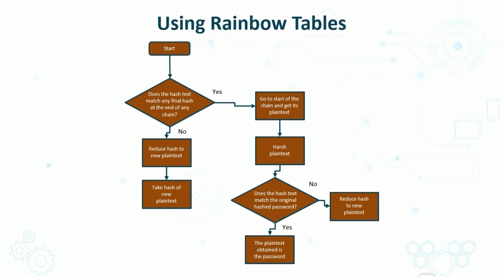

## Password Attacks

* Passwords used every where
* **Password Attacks**
    * Repeated attempts to identify a User Account, Password, or Borth
    * Also runs against stored hashes
    * Attackers use many tecniques
        * Online brute force
        * Offline brute force
            - copy the hashes and take your time
        * Dictionary and word lists
            - common patterns
        * Cracked password lists
            * Cracking the hashes of passwords

### Password Spraying

> * Password attempts to access many accounts, typically targetting SSO and cloud based applications
> * Attackers use few common passwords which can result in lockouts
>   * since brute force causes lockout
> * involve using one password at a time

### Rainbow Tables

> * precompiled dictionary of plaintext passwords
> * w/ corresponding hash to find out what plaintext psswd produced a certain hash
> * more than one text can produce a same hash -- but doesnt matter if you get hash

## Physical attacks

* Malicious USB cables
- malicious exploit from generic usb plugged into PC
- Sometimes a usb-to-lightning cable has a wifi chip in it
    - could be other things like USB malicious code

- Skimming and Card Cloning
    - RFID and NFC tech 
    - Data can be stolen, skimmed and scanned

## Adversarial Artifical Intelligence

* AI/ML being put into adversarial and defenc e intellidence
* A widely discussed attack involves deceiving image classsification algos
* Attackers can skew data
* 3 types of attacks on unsupervised machine learning algos
    1. Evation attacks
    1. data posoning
    1. model stealing

## Supply-chain attacks

* Value chain or 3rd party attack
* Attacker infiltrates through outside partner/vendor/etc
* Risks fo supply chain attacks growing because of attack variants

Example:
 

 ## Cloud based v On Premise Attacks

 > The exams will ask to distinguish between the two

 ### Public Cloud
 > AWS Dynamo DB -- Redshift
 > * Higher technical expertise
 > * Better physical separation
 > * Fewer vulnerabilities (i.e. switch security)
 > * provide hypervisor security 
 > * Newer technology by economies of scale
 > * Better availability, resiliency, and durability

 ### On-premise data center

 > * More experience and familiarity with systems
 > * Transition introduces risk
 > * Single or few accounts introduce single points of failure due to unsecure access keys and management
 > * Social engineering threats are higher here

 ## Cryptographic Attacks

 * Hash Algos give a fixed length output with finite number of outputs
 * Possible for two inputs to give same hash
 * MD5 should be avoided due to collision
 * SHA-1 had theoretical exploits in 2005
 * SHA-2 permitted by NIST in 2006
 * After 2010 Federal Agencies can only use SHA-1 for particular apps and uses

 Birthday Attacks
 > * After the birthday paradox -- chances of 2 people in a group of 32 will have the same b-day 50% of the time
 > * aka plaintext attack
 >      * attacker has ciphertect -- but knows something about plaintext
 >  * Ciphertext-only attacks - attacker only has access to ciphertexts

 ### Downgrade Attacks

 * attack that takes advantage of an pp downgrading communication (from encrypted to decrypted)

 * SSL/TLS vulnerable -- which is why you need to keep TLS at 1.2 or higher 
