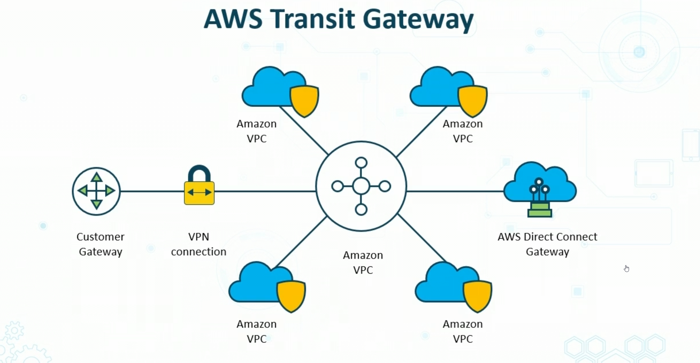
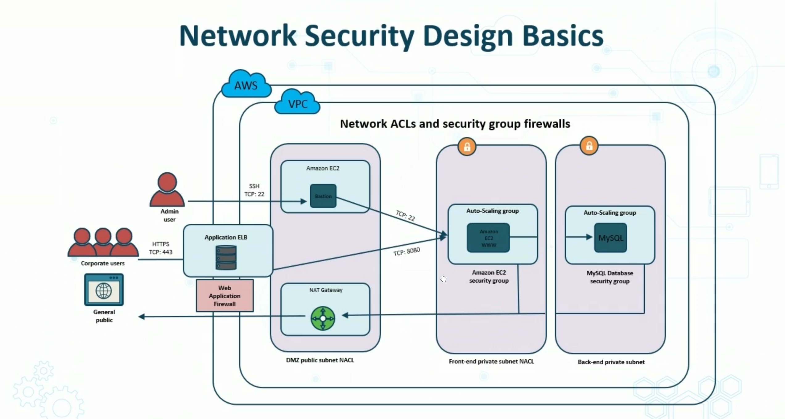

# Virtualization Basics and VM Security

## VMs

- running virtual OS isntances
- refers to above
- to Applications running on top of virtualized machine, seems as though they are on their own deidicated OS

## Hypervisor

- SW that gives virtual infastructure
- Resource traffic cop b/w cirtual components
- How much access they get is maanged here
- Host runs hypervisor
- guest gets resources

## Type 1 Hypvisor

- Built directly on hardware
- ESXi, Hyper-V, OVM, Fusion Sphere
  - OSS --  KVM, open VZ, redhat

## Type 2 Hypervisor

- Hypervisor is installed on host OS
  - VMWARE, or Virtual Box

# VM Vulnerabilities

- VM Sprawl
  - VMs overtake admin's ability to manage VMs and available resources
- Avoidance
  - Strict process for deploying VMs
  - Library standard of VM images
  - Archive under utilized ones
- VM Escape
  - Guest VM process interacts with Host
    - More often in Type2
  - Protection:
    - Patch SW regularly
    - Install only what you need
    - Strong system security (passwords and access)

# Cloud Models

## Cloud Computing Value Propositions

- Cost savings and resource pooling
- Rapid elasticity and agility
  - easier for rapid deployment
  - also gives auto scaling
- On-demand service with broad access
  - AWS broad service and availability
- Measured services w/ visibility
- Security and shared responsibility

## Cloud COmputing Service Types

### Infastructure as a Service

- provision processing, storage, networks, and other resources so consumer deploys/runs sw.
- Consumer does not manage or control cloud infastructure
  - but does control OS, storage and configurations
- customer spins up infastructure
- AWS, Microsoft Azure are examples

### Platform as a Service

- Condumer deploys apps using languages form the provider
- Consumer does not control underlying infastructure, but does have control over deployed apps and possible host configurations

Common Paas Services include:

> - SDK's
> - COntainers
> - DBs
> - Threat intel
> - sign in services

### Software as a Service

- use provider's app on cloud.
- Accessible through different deviced
- Consumer does not maange anything except maybe user-specific app configs

Examples include:

> - CRM
> - wokrplace tools
> - finance tools

## Cloud Models

- Private - deplyed in sandbox within an org
- Public-  deployed by provider for customer consumption
- Community - deployed by a group in a sector
  - partners in busines sector
- Hybrid - combination of private, public, or community

# Cloud Service Proviers Concepts

## AWS Service Offerings

- Archiving
- Backup and Restore
- Blockchain
- Business apps
- Cloud Migration
- Containers
- Content Delivery
- Database Migrations
- Data Lake and analytics
- DevOps
- E-Commerce
- High Performance computing
- Hybrid Cloud Architectures
- Internet of Things
- Machine Learning
- Mobile services
- Modern application development
- Remote work and learning
- Scientific Computing
- Serverless Computing
- Websites

## Managed Security Service Provider (MSSP)

- outsources security mointoring
- Apply to on premise and cloud or btoh
- Common services:
  - layer 3-7 Firewalls
  - IDS/IPS
  - Enddpoint response and detection
  - Cirtual private networking support
- user high-availability op centers
- offer 24/7 services w/ goal of reducing on-premise operational security staff the enterprise needs to hire, triain and retain to preserve security

## Fog Computing

- Also knwon as "fogging" 
- decentralized computing
  - puts data and applications in between data source and cloud
- Benefits:
  - brings analysis to edge
  - improves performance by placing resources where needed
  - Can be security countermeasure for securing datra
  - Can be considered Hybrid as a Service
  - AWS Outposts can facilitate

## Microservices

- service-oriented app components
- Architectural approach where SW made up of small indpeendent services that communivate over well-defined API's
- services maintained by small, self-contained teams of devs
- make apps fast to develop and easier to scale 
- enable fast track delivery

### Features

- Tightly scoped, loosely coupled
- encapsulated
- scalable

# Infastructure as Code

- Offers common language in a file format, defining cloud deployment of instastructure resource in a secure repeatable manner
- Stack files is "single source of truth'
- Stack is collection of cloud resource you control
- Allows you to track and control 

> 1. Code your infastructure using a template languiage (usually in YAML or JSON)
> 2. Use CSP browser console, CMD tools, or API's to create a stack based on your code
> 3. CSP service provisions and configures the stacks and resources you desginate in your template

# Containerization

- Isolated abstracted apps w/ al components needed
- portable modules across platforms and providers
- can be server-based or serverless in cloud
- Contribute to immutability and rapid deployment concepts
  - and massive scalability
- function as VM for Applications

## Docker v Kubernetes

### Docker

- Docker is container platform
  - docker engine runs containers
- Docker is popular

### Kubernetes

- Orchestrator for containe rplatforms
- Comprehensive system for automating deployment, scheduling, and scaling of containerized apps
- supports many container tools, including Docker

# Serverless Architectures

- Let's customer move responsibilty to provider, while enhancing agility
- Also known as **Functions as a Service**
- Eliminates infastructure durtied like provisioning, patches etc
- Can be used for nearly all app/back-end service needed
- WHen building serverless, focus on product instead of overhead
- Reduced overhead empowers developers t owork on product

### Serverless Code

- AWS lambda allows to run small pieces of code
- no need for server
- based on HTTP rtequests, schedule, API, and more

### Serverless Containers

- AWS Fargate, serverless compute ienginer for containers that works with Elastic Container Services and Kubernetes
- Eliminates need to provision and manage servers, lets you stipulate and pay for resources per application, and enhances security through application isolation by design 

## Services integration

DevOps pros, app devs, and sys architechts determine path for cloud-host, SaaS, and on premise

1. Integration platform software
2. Integration Platform as a Service (iPaaS)
3. SaaS vendor tooling
4. Custom coding
5. Function Platform as a Service (fPaaS) (suite of intergrations)

# Transit Gateways

- centralized routed hubs in cloud to connect VPC w/ on-premise networks to single components
- Companied can scale multipole accounts and Vnets
- CSPs allow you to attatch up to 5000 virtual networks
- Support IPSEC

# Cloud Storage Security 

- Cloud storage includes Block and Object Storage
  - Block (Elastic block Storage or Ephermeral)
  - Object Storage is S3
- Managed through IAM service, Cloud-based AD, or often SSO using SAML 2.0
- You can apply Public Access Policies, ACLs, or granual access
- Objects often publiucly access cia URL or API calls wihich should be TLS protected or Digitally Signed
- Data at rest is provided by server-side encryption
- disk drives and snapshots encrypted by default 
- AES 128 GCM or 256 recommended

## Client Side Encryption

- You send encrypted data to cloud (encrypted on site)

## Server-side ENcryption

- You can generate a customer key and use HTTP/HTTPS 

## CSP High Availability and Fault Tolerance

- Ensures continous access and durability by placing reduntant copies in multiple AZs or Regions
- Fault tolerance is provided by CSPs with raid arrayts and secure data centers

# Cloud Network Security

- Begins w/ Virtual Network Subnet Design
- Must evaluate all connectivtity options (gateways, endpoints, VPN)
- Various layer 3/4 static and stateless firewalls
- WAF deployment on load balancers, CDN distributions, API GWs, 
- Managed threat modeling, and DDoS solutions

## Network Security Design Basics

# Cloud Compute Security 

- Security Group firewalls and VPC endpoint policies
- Dynamic resource allocation and visibility
- Container security by design
- Functions as a Service (AWS Lambda)
- API gateway Web Application Firewall

## OWASP Top 10 IoT Vulnerabilities

1. Weak, guessable passwords
2. Insecure netowork services
3. Insecure ecosystem interfaces
4. Lack of secure update mechanism
5. Use of insecure or outdated components
6. Insufficient privacy protection
7. Insecure data transfer and storage
8. Lack of device managemetn
9. Insecure default settings
10. Lack of physical hardening

# Cloud Security Solutions

## Cloud Access Security Brokers (CASB)

- Acts as gatekeeper to enforce enterprise sec policies while cloud being accessed
- Software service implemented bw cloud customer and SaaS provider
- Could be on premise or in-service on cloud

> - Extend ortg's policies beyond local
> - provides visibility, sec, compliance, etc
> - can assist with implemetnation of IAM and SSO

## Next Generation Secure Web Gateway (SWG)

- protects from colume of threats form cloud
- Help sensure users are safely and securely using cloud apps

Features:

> - Web content filtering
> - TLS decryption
> - CASB and DLP
> - Advanced Threat Protection (ATP) including Sandboxing
> - Visibiltiy and rich metadata contect for incident handling/reporting

## Audoit Process Methodoligies for the Cloud

> - Biggest challenge is getting familiar with cloud system decomposition and visibility

## Factors for Auditng Cloud
> - Transperncy
> - Colocation
> - Scale
> - Scope
> - Security and Privacy
> - Complexity

### Types of AUdit Reports

- SAS Statement on AUditing Standards No. 70
- SSAE Standards for Attestation Engagements no. 16
- ISAE Internation Standard on Asssurance Engagements No. 3402
