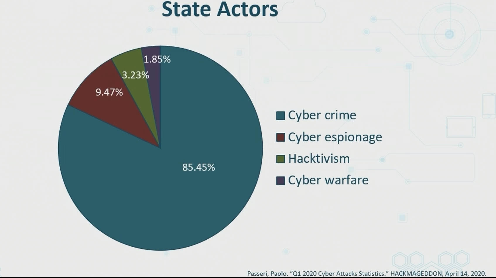

# Threat Actors, Intelligence Sources, & Vulnerabilities

## Threat Actors and Agents
- Threat is not realized unless there is an *AGENT*
- Threat Agent are persons,methodstechniques systems, entities, that act, or potentially act - to carry out exploit or threat
- Threats realized through Agents or Catalyst
- Can be indv or group

### Actors and Threats
- Human Errors
- Hostile Cyber Attacks
- Data breaches and theft (or leaks)
- Cognitive threats via Social networking
    - Or employee owned devices
- consumer electornics
- critical infastruture 
- network failuers

### Advanced Persistent Threats (APTs)
- Longterm malware campaign
- pre-planned w/ cost benefit analysis 
    - *(Is this worth the cost?)*
- Persistent in acticity and state of existence
    - try in different attack vestors
    - also allow malware payload to exist forever
- Very often from nation state actors
- Sophisticated wtih multiple phases

### Insider Threats
- Look for upset or desperate emplyees with privledge
- possible blacktortion or intimidation
- Always consider ex-emplyees after breach
- APTs can involve emplyee with fake ID or someone using "Shadow ID"
    - Installing a type2 hypervisors unauthorized
- Background checks and audits are critical
    - and additional ones throughout lifecyce of emplyment

### State Actors
- World War C -- Many of the same activities of criminal syndacites
- Cyber warfare - espionage - blackmail
- Zero-days on systems everywhere
- DDoS attacks are of great concern

### Hactivists
- Began in late 80s
- Many vectors and actors
- ie Anonymous 
    - Defacing, DDoS, URL hijacking
    - Political and Environmental hackers

### Script Kiddies
- From inexperienced crackers
- Using sript ciruses
- spread from email
- usually originate from YT or dark web

### Organized crime groups

- **White Hat** know extensively of teh system
- **Grey Hat** know some info
- **Black Hat** know nothing

## Attributes of Actors

- **internal or external** and **structures or unstructured**
- intent and motivation
    - For info? money? get revenge? notoriety? ex employee?
- Sophistacation and skill sets
    - contact frequency (remote or physical to target)
    - resources from dark web or coding
- threat event frequency
    - how often with they use the exploit? 
- Recources and Funding
    - nation state might have a lot
    - For ransomeware attackers, they require funding from targets

### Structured v Unstructured

#### Structured
- Planned
- Organized
- Persistent
- Multi-phased
- Can be internal or external
- Can involve exploit kits, zero-days, modules, ransomeware

#### Unstructured
- Accidental
- Non-malicious
- Drive by web surfing
- No AUP
- Poor Awareness
- Email and webmail
- USBs and personal electronics

### Intent and Motvation

## Threat Vectors

- Direct physical access (removable media)
- Remote Access (VPN or no VPN)
    - If using unsecure deployments can also be a consideration
- Wireless, satellite, and cellular
    - avoiding automatic connection to acces points
- Email, webmail, or messaging
- Supply Chain
    - do you have to consider security of vendors and customers
- Social media
- Personal or public cloud computing
    - Those single signon credentials
    - is that using MFA

## Threat intelligence sources

- Vulnerabilities can be stuff you are aware of, or can be unknown

**Indicators of Compromise**
- Tells ou if something on service or website that is a part of an attack 
- Tells you if objects and state of systems that have been compromised
- Network or host based cyber observables
- Forensic artifcats of an incursion
- Measureable events   
- Registry entries files and disk activities

**Vulnerability Databases**
- Collection of info on PC Sec Vulns
- categorizes and defined vulns 
- measures potential impact based on qualitative scale (ie 1-5)
- Depending on servicem you may get workarounds, patches etc

Common resources:
* MITRE CVE
* NIST Vuln DB
* ISS X-Force DB
* Symantec BID DB
* @RISK from SANS.org

**Dark Web**
- needs special software, configs, and authorization
- Deep web not indexed
- P2p networkin
- Tor, Freenet, I2p and RIFFLE

> Can be used to find
> - Botned
> - Bitcoin services
> -  Marketplaces
> - hacking groups
> - Fraud and hoaxing
> - financing
> - Phishing
> - Puzzles
> - Terrorism
> - illegal porn

**Open-Source Intel**

> - OSINT is any openly available data
> - on and off the internet
> - can be compiled and visualized on Maltego, sharing centers, code repos like Github and others

**Other sources**

- **Automated Indicator Sharing** 
    - from DHS which provides different IPs and other info
- **STIX - Stuctured Threat Information Exchange**
    - provides machine readable ways to share info on cyber attacks and threats
- **Predictive analysis and threat maps**
    - AWS Google 
- **TAXI - Trusted Automated eXchange fo Indicator Information**
    - supports ways to transport more info on attacks

## Research Sources

- Vendor websites
- Vuln Feeds
    - like CVE DBs
- Conferences
    - Blackhat confs, SANS etc
- Academic Journals
- Request for Comments (RFC) (And NIST publixations)
- Local industry groups
- Social Media (with grain of salt)
- Threat Feeds (SANS CISCO Advanced Malware Protection etc)
- Adversary Tactics, techniques and procedures (TTP)
    - how actors orchestrate and manage their attacks
    - also shows their methodolgy
- OSINT tools
    - Maltego, visualizes all the info available
    - HArvester for subdomains and other things
    - Google-Dorks
- Emerging social media tools
- Word of mouth

## Cloud v On-premise

Public Cloud:
- majority is external threats
- Access keys must be protected 
    - never use root accounts
- Many accounts reduce attack and blast surface
    - break up organization to units
    - Keeps compromise small
- Managed sec service providers (MSSP) and CLouse Access Service Brokers(CASB)

On-Premise:
- Bigger threat internal
    - More threats at Layer 2
    - C-suite or C-Team
        - they can increase threat bc no expertise
    - DB engineers and architecht
        - they can be disgruntled
    - Highly privleged sec personnel
    - HR and legal departments
        - bc they may have too much accesss 

## Zero-Days

- recently discovered exploit,malware, for a vuln that attackers then use
- can be unnoticed for years -- can be sold for large sums
- Considered 0-day before and on day discovered
- CVE lists the recently discovered vulns -- but there are millions
- AWS GuardDuty and other toold use cuting-edge countermeasures

## Weak Configurations

- Two huge areas of vuln
- weak config services
- weak config of accnts

* Human error is #1 vuln
* Deploy change config and patch mgmt for automation
* Peer reviews and dual operator are beneficial
* Test configs in VLAB or priv cloud before deploymeny
* Do not be first customer to test product
* Store config files in document library

### Weak configs
* Open permission, ports or services
* Errors sent to logs and SIEM systems
* upgrade CRYPTO systems
    * ie TLS 1.0 -> 2.0
* Unsecure Protols
    * if you cant secure, enable sec mechanisms to protect
* Remove default passwords and settings where possible

### Improperly Config Accnt
> * Biggest issue is overprivledged users
> * Logging, auditing, and reporting
> * Least privledge principle should be used
> * User seperate account for admin tasks (run as...)
> * Use centralized directory of users
> * Vuln to privleged insiders

Examples of users:
* Local admin
* Privlged
* Forest/domain admins
* Emergency Accounts
* Service Accounts
* Apps accnts
* Shared accts
    - dont use this
* Cloud Service Provider accts
    - w/o SSO users may manage mutliple accounts

## Third Party Risks

> - Vendor mgmt
>   - Supplier management practice -- need to make sure they manage themselves properly
>   - Security should be applied at entire lifecycle
> - System integrations
>   - Put sec in all stages 
> - Lack of vendor supports
>   - either improve support or move on
>   - may need legal to fulfill support
> - understand entire supply chain of production
>   - services may be more digital
> - Outsourced code - make sure you get secure FULLY TESTED code (and digitally signed)
> - Data storage

## Improper Patch Management

> - many orgs do not improve patch management plans
> - Vuln/Exposure revies and gap analysis needs to be done
> - CMDB (configuration management dataabse) of all Configuration Items (CIs) should be maintained
>   - then you need to keep track of changes
> - Only certain personnels have authority to test, apply and detemine urgency
> - Agreements with applicable vendors should be made to to address potential issues before patch deployment

## Impacts of Legacy Platforms

Risks:
> - Data loss, breach, and exfiltration
>   - Part of moving to containers, is so you can just change containers when out of date
> - Identity theft
> - Financial loss
>   - especially with IoT devices (embedded dvices less likely to be patched)
> - Loss of reputation and goodwill
>   - because customers wont think twice
> - Availability loss
>   - Legacy platforms are more vulnerable

